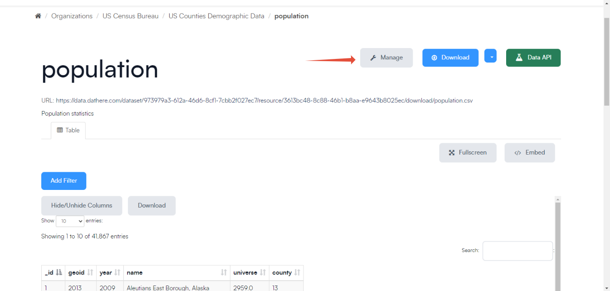
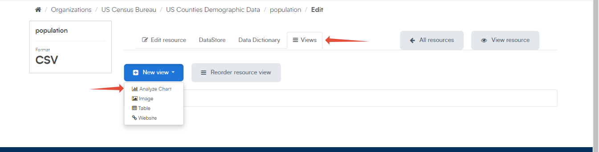
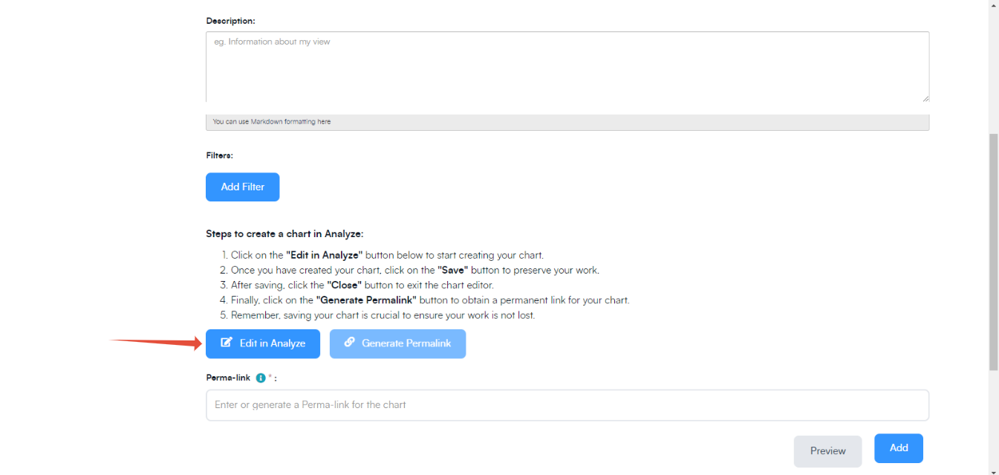
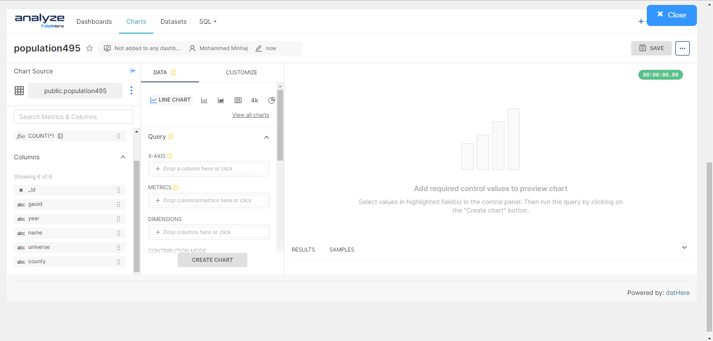
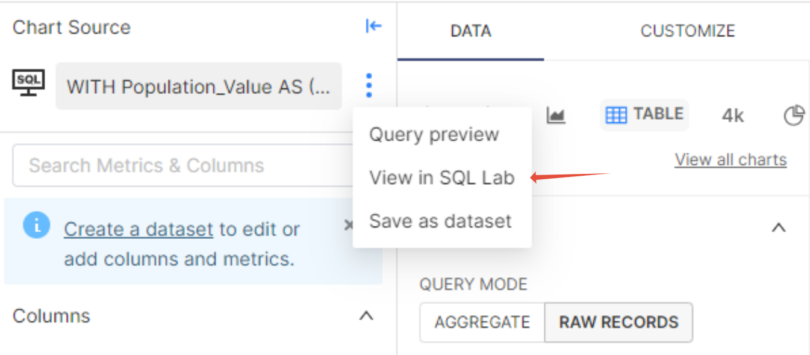
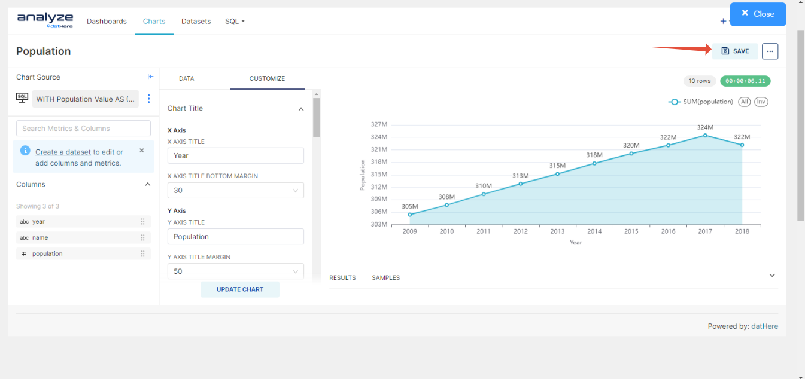
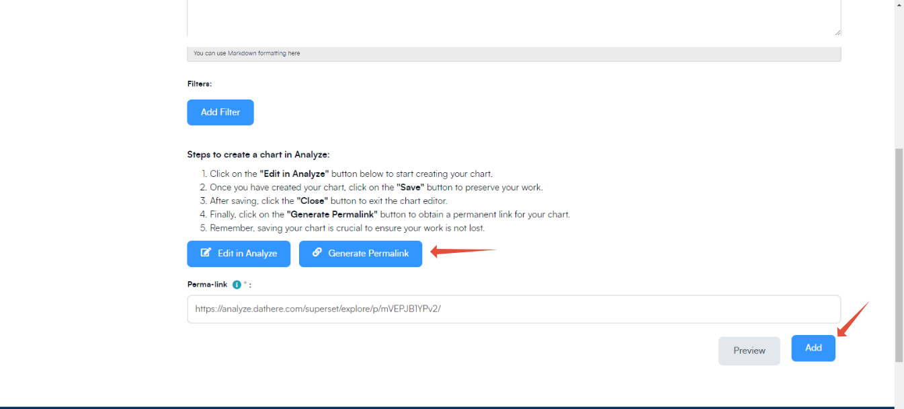
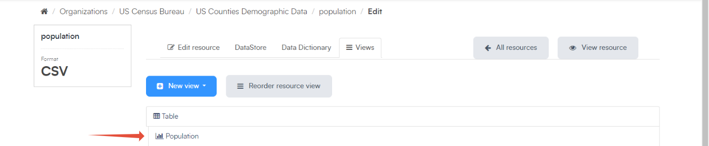
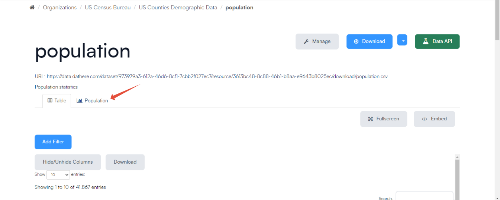

# How to Make Charts using Analyze through datHere

```
Before proceeding, ensure that you are logged into both data.dathere.com and analyze.dathere.com. This is necessary as the extension is sourced from analyze.dathere.com.
```

Creating charts using the Analyze service on datHere's website offers unparalleled convenience for users seeking to visualize their datasets. Powered by [Apache Superset](%20https%3A//superset.apache.org/), datHere's user-friendly interface and robust features simplify the process of chart creation, allowing users to effortlessly transform raw data into insightful visual representations. Moreover, users can seamlessly view these charts alongside their datasets, enabling a comprehensive analysis and deeper understanding of the underlying data patterns. This integration between charting and dataset exploration enhances efficiency, making datHere a valuable tool for data-driven decision-making and exploration.

```
Attention: Ensure that no browser extensions, such as ad-blockers, are active and potentially blocking windows. In such cases, the Analyze extension may fail to appear.
```

# Instructions

- Step 1: Edit in Analyze
- Step 2: Creating a chart through Analyze
- Step 3: Creating a Permalink

### Step 1: Edit in Analyze

- Select your desired dataset and click on Manage.
- 
- Click on "Views" and then "Analyze Chart"
- 
- Scroll down and click on Edit in "Analyze".
- 

### Step 2: Creating a chart through Analyze

- It'll take you to Analyze datHere to create your charts.
- 

- Click on the three dots to make any changes to the SQL script.
- 
- Once you are done creating your chart, make sure to click on "SAVE".
- 

### Step 3: Creating a Permalink

- After saving your chart, click "Generate Permalink" and press "Add".
- 
- You'll be able to view it through datHere when you click on your dataset.
- 
- 