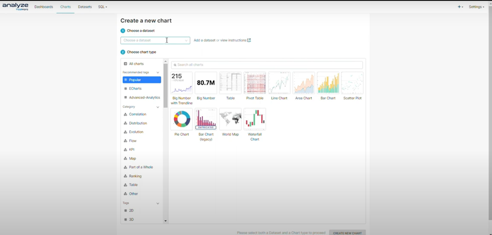
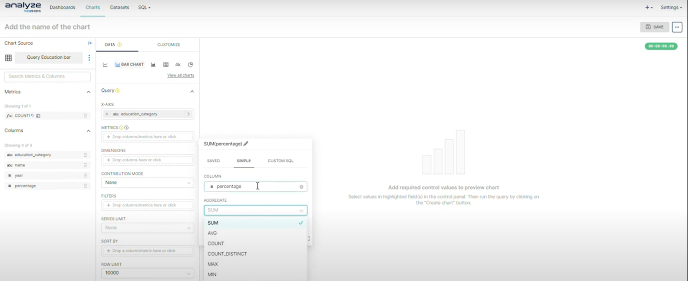
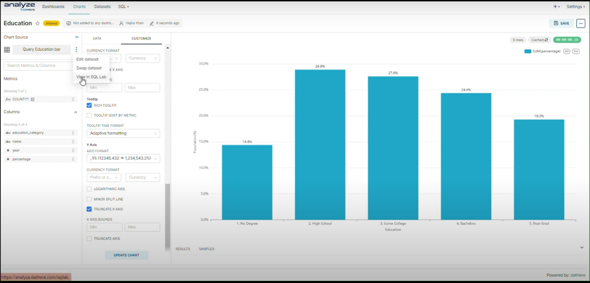

# How to Make a Bar Chart on Analyze datHere

Bar charts are indispensable tools for conveying data insights concisely, and this tutorial equips you with the essential skills to construct them with precision. Learn how to customize every aspect of your bar charts, from colors and labels to axis formatting, ensuring clarity and impact in your visualizations. Furthermore, discover the seamless integration of Analyze datHere with SQL data, enabling you to seamlessly leverage your database queries to populate and update your bar charts in real-time.

# Instructions

Creating a Pie Chart

- Step 1: Creating a New Chart
- Step 2: Using data to create the chart
- Step 3: Customizing your chart

### Step 1: Creating a new chart

- Click on the Charts tab to create a new chart. Select your preferred dataset and chart type, then proceed by clicking on the option labeled "Create new chart".

### Step 2: Using data to create the chart

- Utilize drag-and-drop functionality to transfer columns into the query section, placing them under either "Dimension," "Metric," or "Filters" categories as appropriate. For metrics, designate the desired aggregate function before saving the selection. Upon completion, proceed by clicking the "Create Chart" button.
- 

### Step 3: Customizing your chart

- Click one the customize tab to see the wide variety of customization options. Here, you can adjust parameters such as label type, including options such as percentage, category name, and value, among others. Additionally, you can modify orientation, alter the color scheme, and more. Remember to click on the "Update Chart" button after each modification to apply the changes effectively.
- 