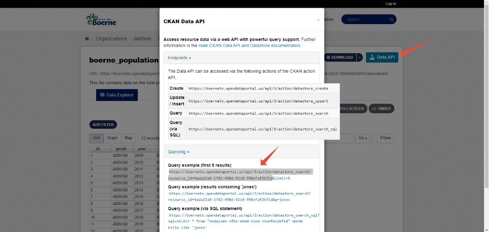
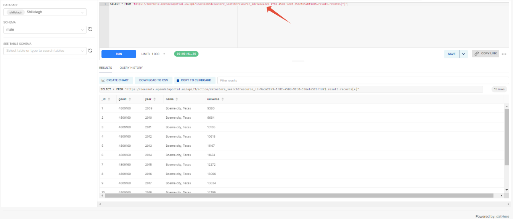
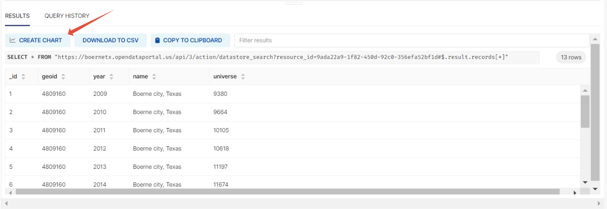
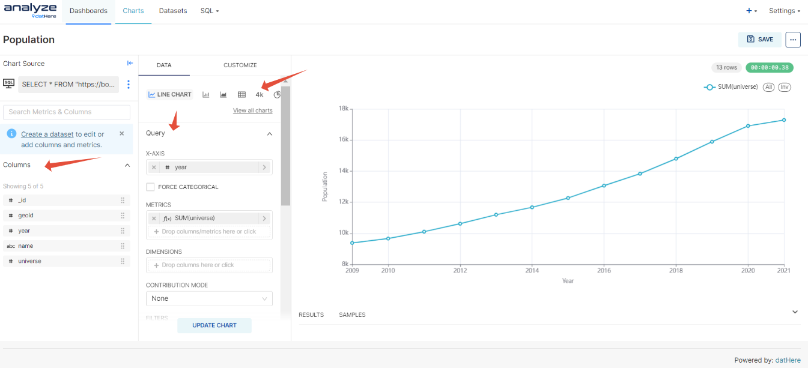
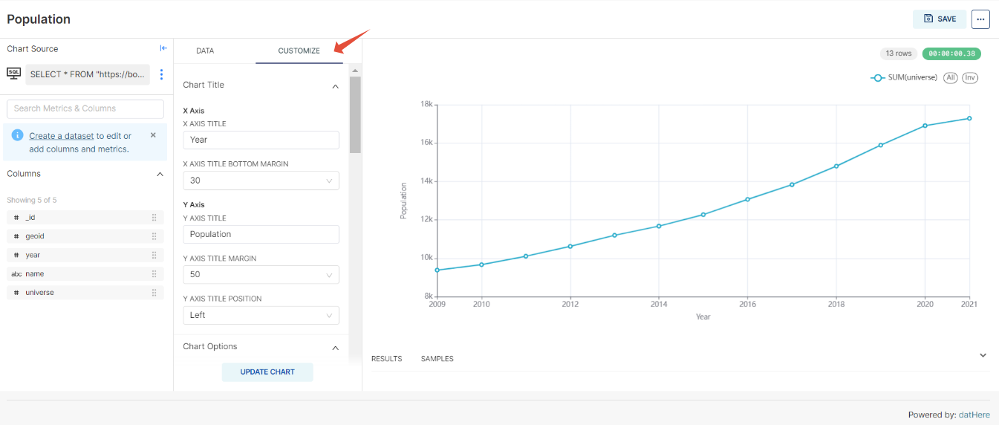
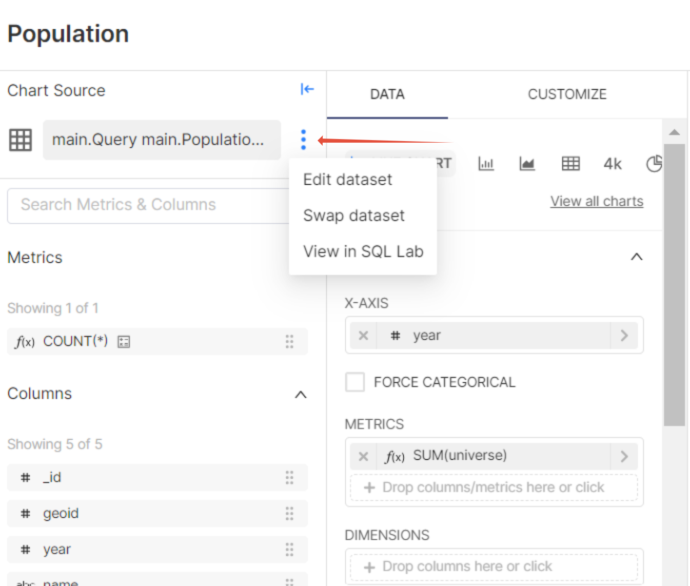

# How to Make a Chart and Dashboard using Ckan API

```
Before proceeding, ensure that you are logged into both data.dathere.com and analyze.dathere.com. This is necessary as the extension is sourced from analyze.dathere.com.
```

Create charts and dashboards using the CKAN API through datHere's Analyze service, users can follow a straightforward process. First, they access the Analyze feature on datHere's website, which seamlessly integrates with the CKAN API. This integration allows users to import datasets directly from CKAN and leverage [Apache Superset](https://support.dathere.com/a/solutions/articles/%20https%3A//superset.apache.org/)'s robust capabilities for data analysis and visualization. With a user-friendly interface, users can effortlessly generate various types of charts such as bar graphs, line charts, and pie charts to represent their data insights. Additionally, users can assemble interactive dashboards that offer a comprehensive view of the dataset and its associated visualizations, enabling informed decision-making and deeper exploration of data patterns. This integration between charting and dataset exploration enhances efficiency, making datHere a valuable tool for data-driven decision-making and exploration. 

# Instructions

- Step 1:  Copy the link from the CKAN Data API
- Step 2:  Paste the link to the SQL lab in Analyze datHere
- Step 3: Create your chart

### Step 1: Copy the link from the CKAN Data API

- Click on the Data API button from the data you want and copy the link from the Query example.
- 

### Step 2: Paste the link to the SQL lab in Analyze datHere

- Go to Analyze datHere and click on the SQL tab to find the SQL Lab
- Type the following: Select \* from "[insert the link] and add #$.result.records[\*]" and click RUN to see your data.
- 
- 

### Step 3: Create your chart

- Click on "Create Chart"
- 
- Next, select the type of chart you'd like and drag the columns to where it's needed.
- 
- Then, use the customization tab to make any changes to the chart,
- 
- Lastly, click on the three dots to edit dataset, swap dataset or View in SQL Lab
- 

### Additional Resources:

- [How to make a Line chart on Analyze datHere](https://support.dathere.com/en/support/solutions/articles/154000133107-how-to-make-a-line-chart-on-analyze-dathere)
- [How to make a Bar chart on Analyze datHere](https://support.dathere.com/en/support/solutions/articles/154000133114-how-to-make-a-bar-chart-on-analyze-dathere)
- [How to make a Pie chart on Analyze datHere](https://support.dathere.com/en/support/solutions/articles/154000134406-how-to-make-a-pie-chart-on-analyze-dathere)