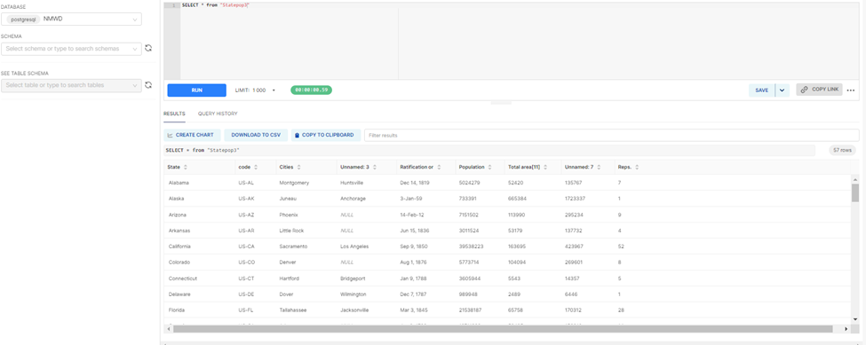
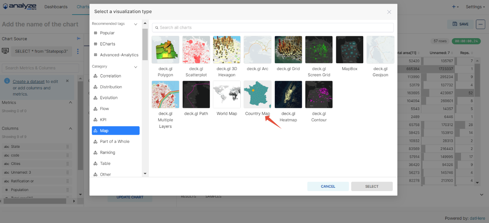
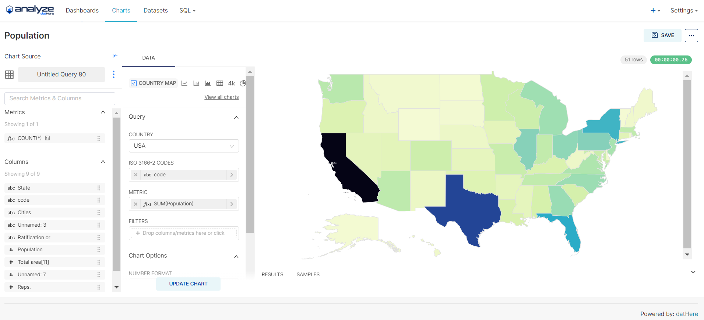
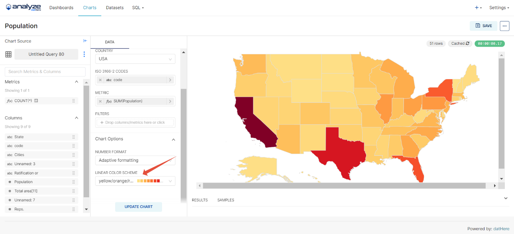

# How to Make a Heatmap on Analyze datHere

Heatmaps are powerful tools for visualizing data distributions effectively, offering a clear and concise representation of insights. This tutorial equips you with the skills to create and customize heatmaps with precision, from manipulating colors and labels to formatting axes, ensuring clarity and impact in your visualizations. Additionally, explore the seamless integration of Analyze datHere with SQL data, enabling real-time updates and dynamic insights directly from your database queries. Whether you're new to heatmaps or refining your expertise, this tutorial provides the tools to create compelling visualizations that convey complex data patterns intuitively.

# Instructions

Creating a Heatmap

- Step 1: Use SQL Lab to gather your data
- Step 2: Create a New Chart
- Step 3: Customizing your chart

### Step 1: Use SQL Lab to gather your data

- Enter in your query to SQL Lab using the Select statement.
- 

```
To make a heatmap, make sure it has the ISO 3166-2 codes.
```

### Step 2: Create a New Chart

- Select "County Map"
- 
- Select the Country and utilize drag-and-drop functionality to transfer columns into the query section, placing them under either "Dimension," "Metric," or "Filters" categories as appropriate. For metrics, designate the desired aggregate function before saving the selection. Upon completion, proceed by clicking the "Create Chart" button.
- 

```
Make sure to save your dataset before proceeding.
```

### Step 3: Customizing your chart

- Navigate to the Linear Color Scheme section and choose "yellow/orange/red" to visually represent data with colors corresponding to their values.
- 

```
Please remember to save your chart to prevent any potential loss of work.
```