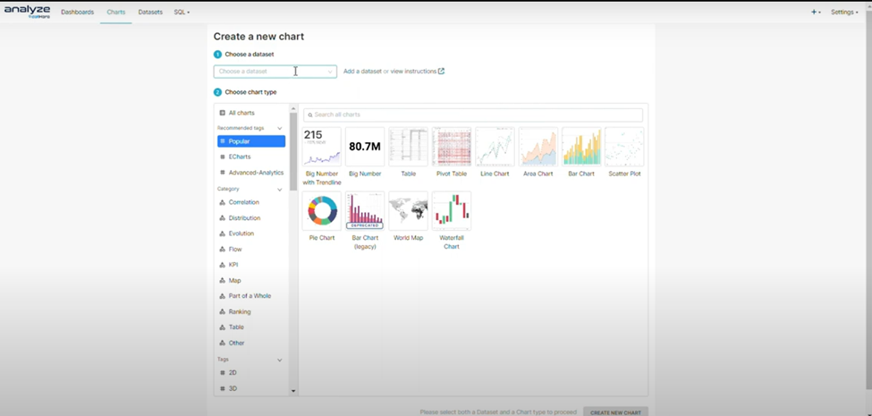
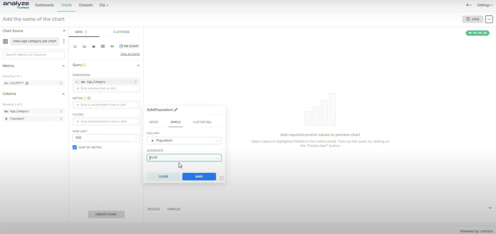
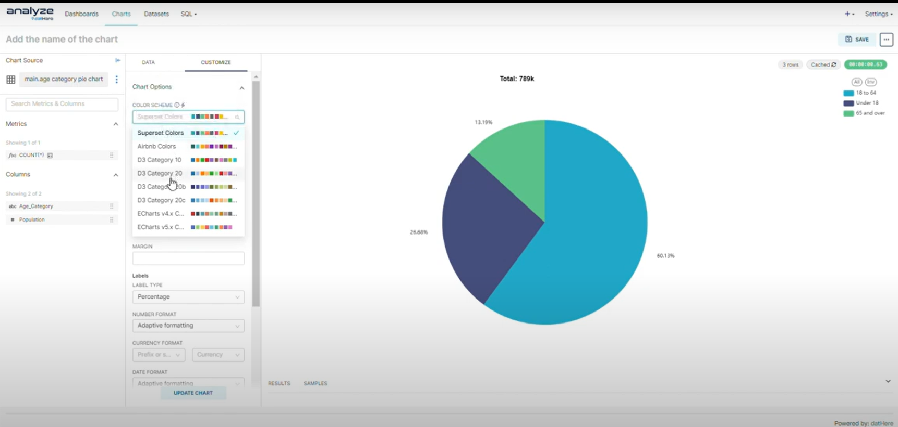

# How to Make a Pie Chart on Analyze datHere

Pie charts are a fundamental tool for data visualization, offering a succinct way to represent proportions within a dataset. Our tutorial not only demonstrates the step-by-step procedure for generating a pie chart but also delves into the customization options available within Analyze datHere, allowing users to tailor their charts to specific preferences and requirements. Furthermore, we explore how SQL data can be seamlessly integrated into the charting process, empowering users with the ability to visualize and analyze their data with precision and clarity.

# Instructions

Creating a Pie Chart

- Step 1: Creating a New Chart
- Step 2: Using data to create the chart
- Step 3: Customizing your chart

### Step 1: Creating a new chart

- Click on the Charts tab to create a new chart. Select your preferred dataset and chart type, then proceed by clicking on the option labeled "Create new chart".

### Step 2: Using data to create the chart

- Utilize drag-and-drop functionality to transfer columns into the query section, placing them under either "Dimension," "Metric," or "Filters" categories as appropriate. For metrics, designate the desired aggregate function before saving the selection. Upon completion, proceed by clicking the "Create Chart" button.
- 

### Step 3: Customizing your chart

- Click one the customize tab to see the wide variety of customization options. Here, you can adjust parameters such as label type, including options such as percentage, category name, and value, among others. Additionally, you can modify orientation, alter the color scheme, and more. Remember to click on the "Update Chart" button after each modification to apply the changes effectively.
- 