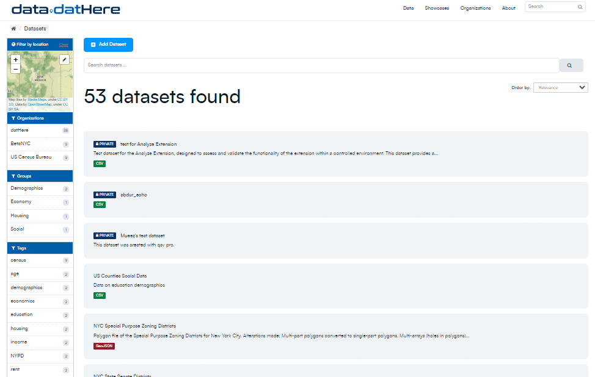
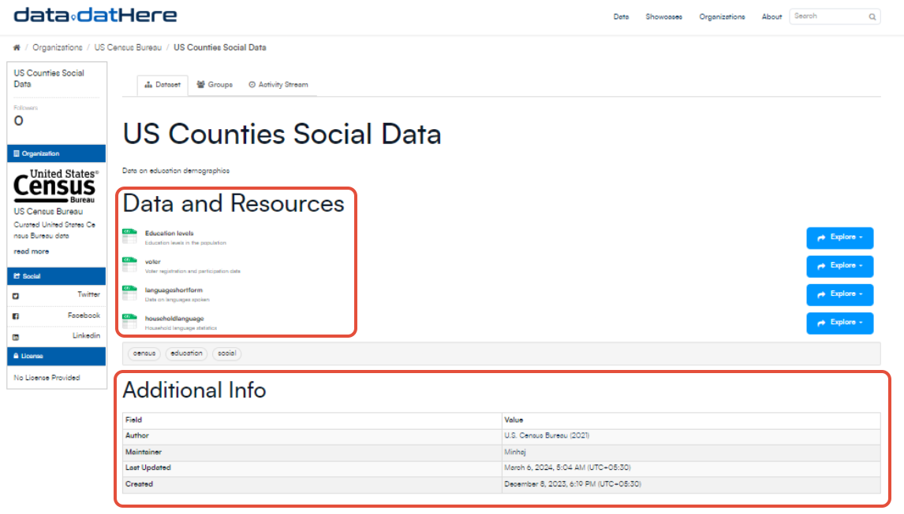
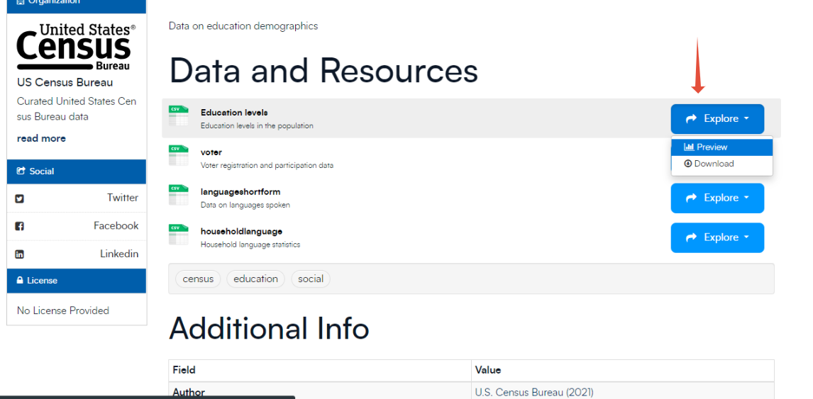
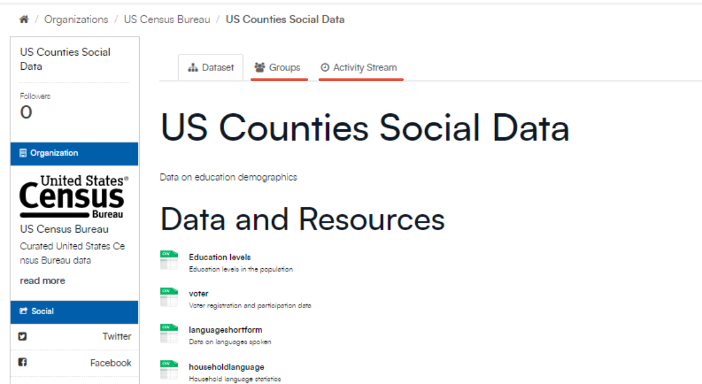

# Datasets in CKAN

In CKAN, datasets act as packages, each containing valuable information.

 

When conducting a data search, what you get in results are individual datasets. Each dataset consists of two important components.

Firstly, there's information about the data (aka metadata) such as the title, publisher details, publication date, available formats, and licensing specifics. 

Secondly, there are resources inside, containing the actual data. CKAN seamlessly handles data in diverse formats, including CSV, Excel, PDF, images, and more.

CKAN can store these resources internally or as direct links to where the data resides on the web. A single dataset can encompass multiple resources, meaning One dataset can have multiple resources, catering to variations like different years or the same data presented in different formats. 

Inside a dataset, you have the option to either preview or download the dataset based on your specific needs.

While navigating the dataset interface, you can access the Groups tab, which displays the groups to which the dataset belongs. Additionally, there's the Activity Stream tab, offering insights into previous actions and changes made to this dataset.

CKAN simplifies the process of exploring and utilizing data, providing a flexible platform for your data explorations.

---

### Additional Resources

For an in-depth understanding of CKAN datasets, check out the [official documentation here](https://docs.ckan.org/en/2.9/user-guide.html#datasets-and-resources).

If you need assistance or have queries, visit our [support page](http://support.dathere.com) for more information

[►Publishing Datasets in CKAN: [Guide]](https://support.dathere.com/en/support/solutions/articles/154000133604)

[►Reordering Resources in CKAN Dataset: [Guide]](https://support.dathere.com/en/support/solutions/articles/154000133613)