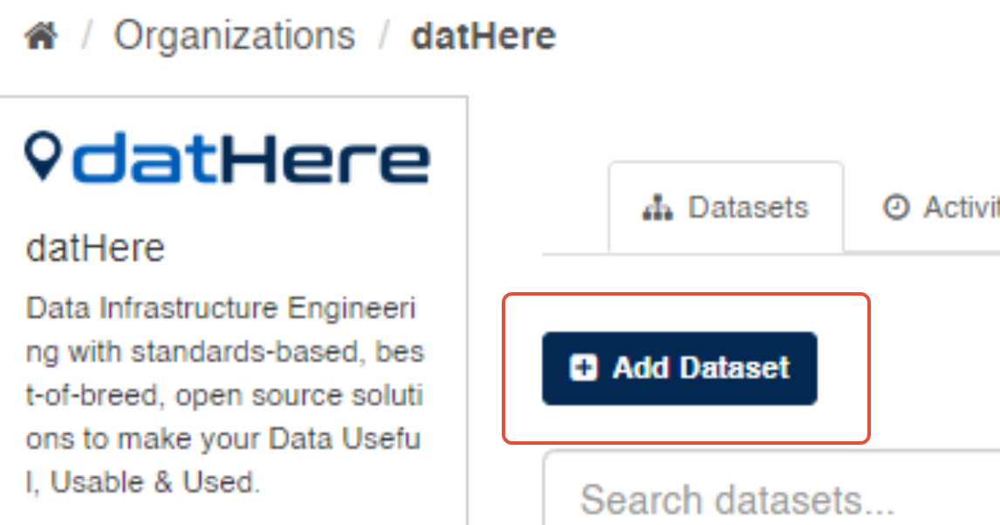
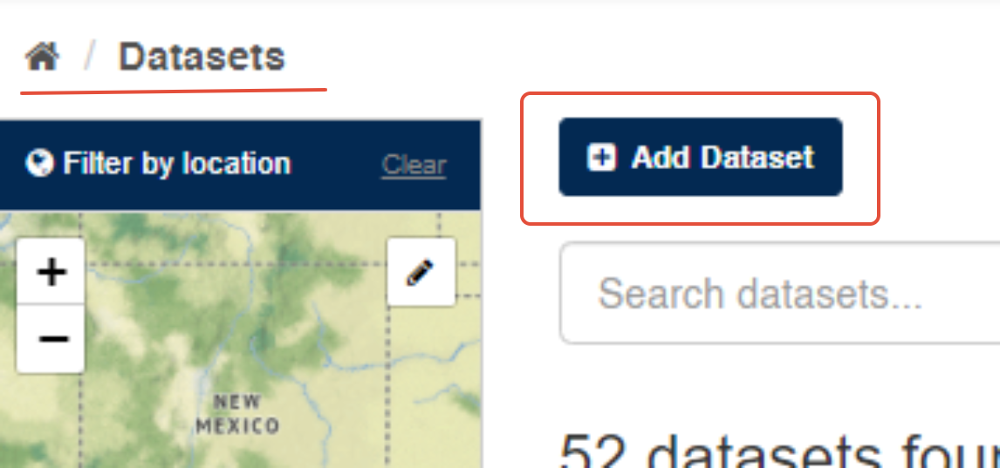
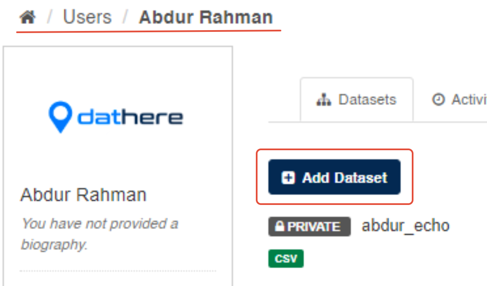
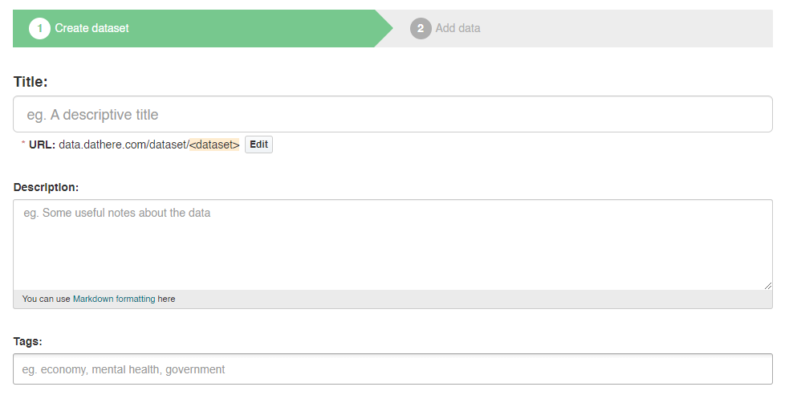

# Publishing Datasets in CKAN: [Guide]

Adding datasets in CKAN is a fundamental process that empowers to catalog, organize, and share data with ease. Follow along as we break down the steps, providing clear instructions to ensure a smooth experience. By the end of this tutorial, you'll be well-equipped to harness the full potential of CKAN, turning raw data into a curated and accessible resource for the users.

## **Step 1.** Click CKAN’s “Add dataset” button.





There's an "Add dataset" option 

- on the datasets page,
- another when accessing the organization's data,
- and a button within the datasets function on your profile

```
What are datasets?  
A CKAN datasets (aka Packages for earlier versions of CKAN) is a collection of data resources (such as files), together with a description and other information, at a fixed URL. Datasets are what users see when searching for data.
```

## **Step 2.** Provide the details for the dataset



**Fields (In order of their appearance):-**

   

**Title:**The title serves as the name of the dataset, meaning that no two datasets can share the same name. Exercise caution when selecting a suitable name, ensuring it accurately reflects the overall data contained within it. It is a Mandatory field

**Description:** Feel free to provide a more detailed description of the dataset in this section. Include details such as the data's source and any pertinent information that users may find useful when working with the data. Description is not a mandatory field but highly recommended among the users

**Tags:** In this section, you have the option to include tags that aid in discovering the data and establishing connections with other relevant datasets. Press the return key between tags to while entering them. Tags aren't mandatory  
  
**License:** Providing license information is crucial to inform users about the permissible use of the data. This field should be a drop-down box. If the required license is not available in the list, please get in touch with your site administrator. License field aren't mandatory

## **Organization:** Select your organization from the dropdown menu

## **Visibility:** Toggle visibility setting here for the dataset to published as Public or Private

## **Custom fields:**there's also an option to add custom fields for the datasets

## **Step 3.** Click the "Next:Add Data" button to start adding the data files:

## 

You can add data files by uploading from your computer or simply by pasting the URL into the box. Enter the name that should be displayed along with the description, and you're good to go! If you need to add more files, click the 'Save and Add Another' button. Finally, click 'Finish'.