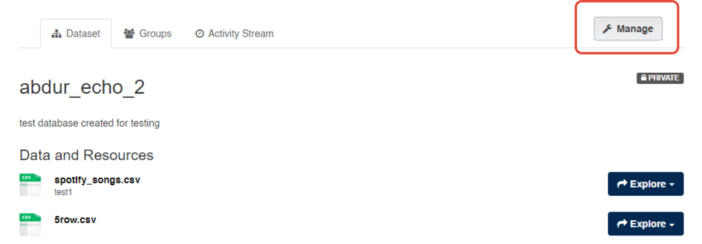
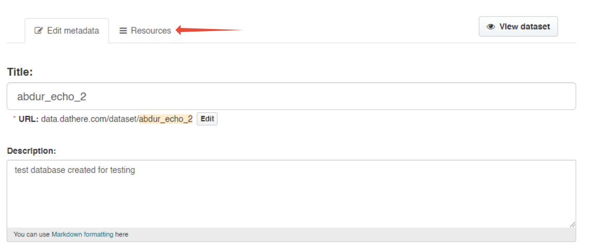

# Reordering Resources in CKAN Dataset: [Guide]

Organizing resources in CKAN datasets allows you to showcase data in a proper way. Follow this step-by-step tutorial to know how to learn reorder resources.

### **Navigation Roadmap**

## Dataset > Manage > Resources > Reorder Resources > Save Order

### **Step1.**

Navigate to the dataset you wish to rearrange the resources for and click on it

### **Step 2.**

### **Step 3.**

## 

### **Step 4.**

---

### Additional Articles

For information head over to our [support page](https://support.dathere.com/support/solutions)