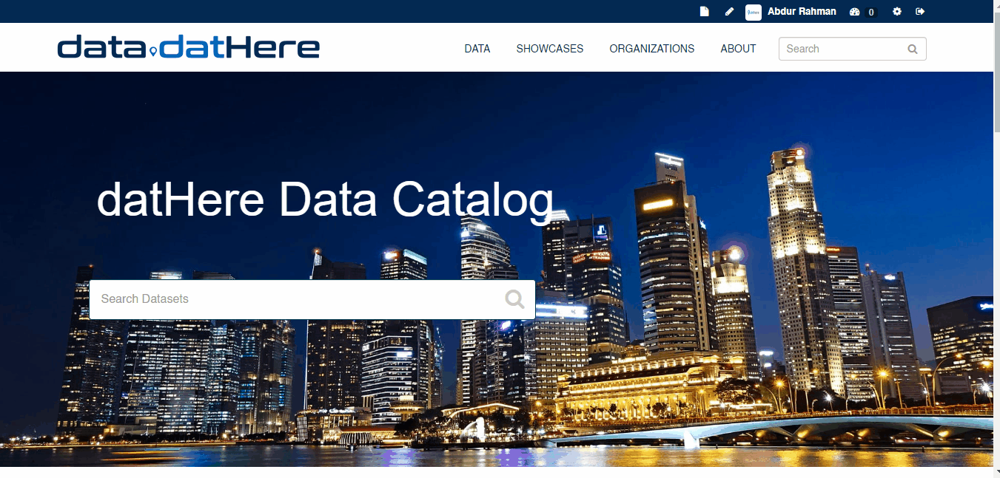
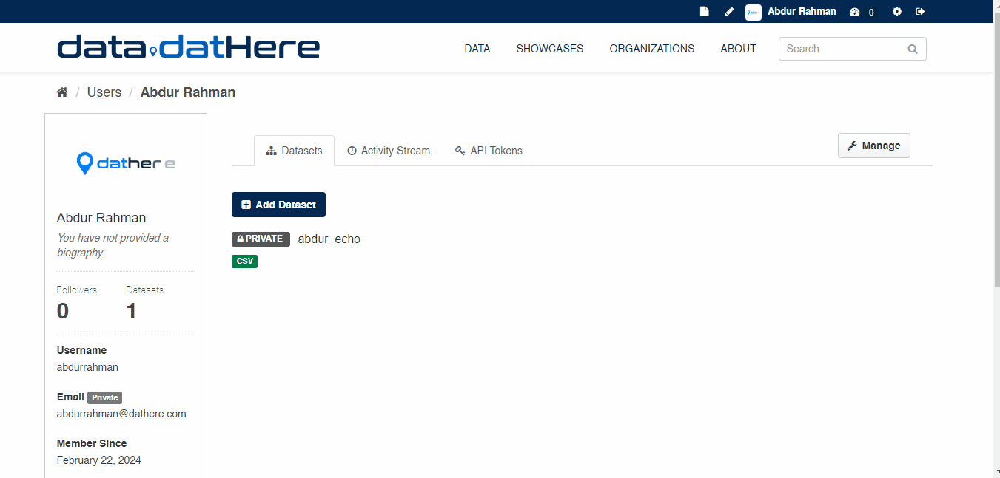
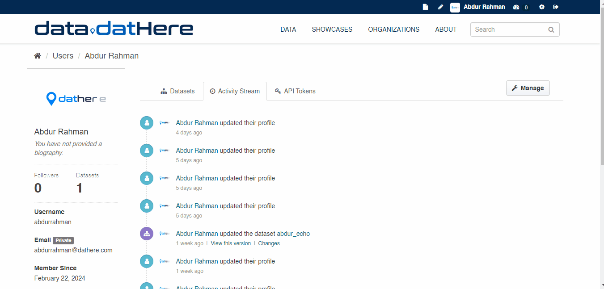
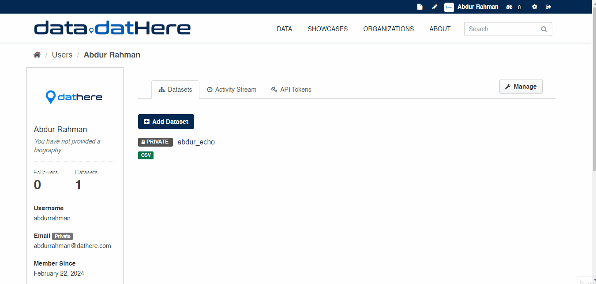

# Managing your Profile in CKAN

You can update the information that CKAN stores about you, including what other users can see. This is particularly useful when you edit datasets or upload data to an organization that other users are following.

On the user settings page, you have the option to modify...

- Your full name
- Your email address (note that this information is not visible to other users)
- Your profile text, which is an optional short paragraph about yourself
- Your password

Once you've made the necessary changes, click on the "Update Profile" button to save your updates.

```
Users are most likely to see your profile when you edit a dataset or upload data to an organization that they are following
```

This article will walk you through the steps to access and customize your CKAN profile.

## **1. Navigating to Your Profile:**

Begin your journey by clicking on the username located at the top right corner of your screen. This will lead you to your CKAN profile.



### 

### **2. Your Profile Dashboard:**

Your profile isn't just a static page; it's a dynamic dashboard that provides insights into your CKAN interactions. Here you could see if you have followers, datasets associated with your name, or any recent edits.  


### **3. Activity Stream:**

On the left side of your profile, you'll find the activity stream. This feature acts as your digital journal, detailing changes and edits you've made. It's a handy tool to track your contributions within the CKAN community.



### 

### **4. Managing API Tokens:**

Directly besides the activity stream lies the section for API Tokens. Here, you have the power to edit or create new API keys under your name. These tokens play a crucial role in enabling secure interactions with CKAN API's.  
  


### **5. Editing Your Profile Information:**

To add a personal touch, click on "Manage." This will open up a range of options where you can edit your username, email, and share a brief description about yourself and update your password  
  


---

### Additional Articles

For information head over to our [support page](https://support.dathere.com/support/solutions) or to know more about Managing your profile refer the [official documentation here](https://docs.ckan.org/en/latest/user-guide.html#managing-your-user-profile)