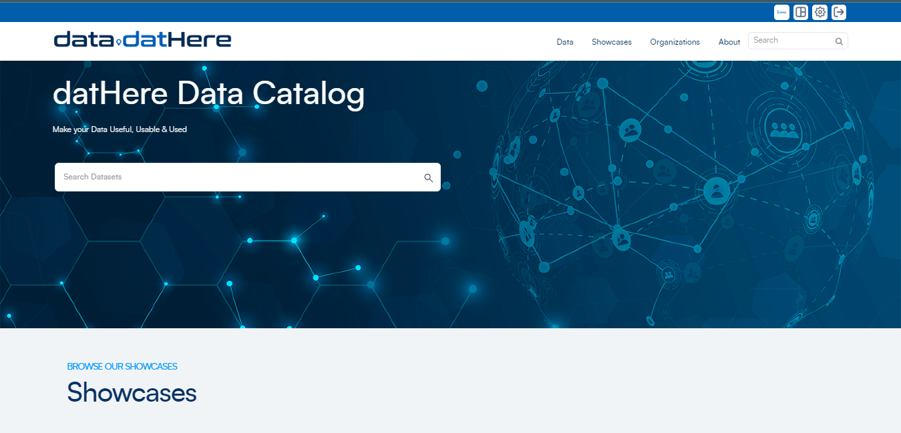
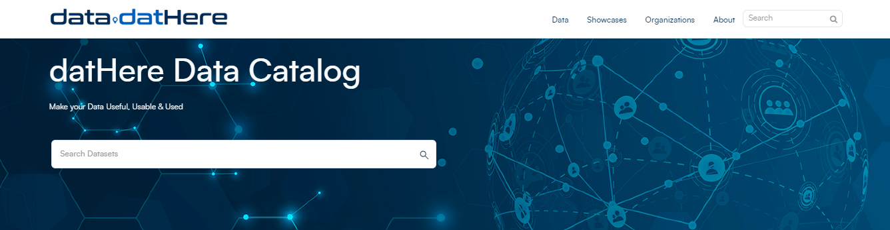
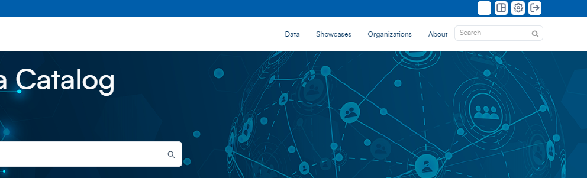
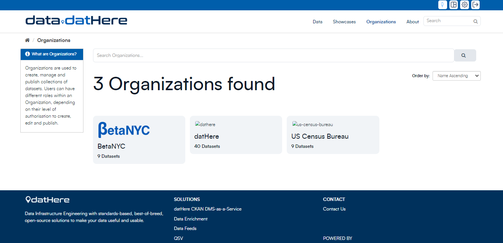
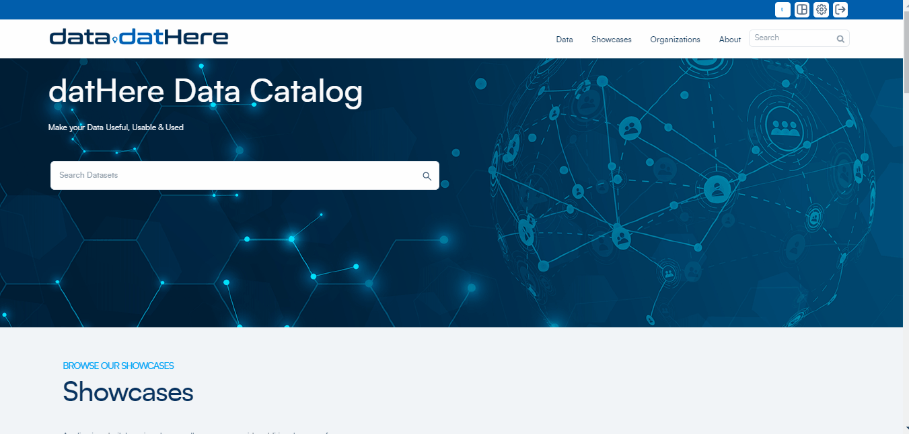
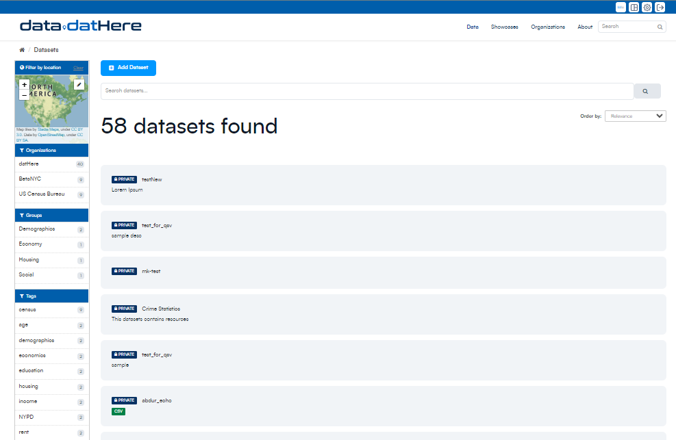
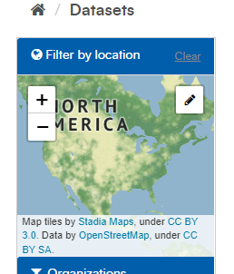
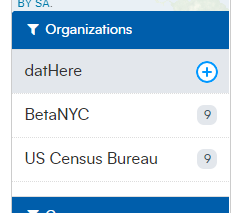
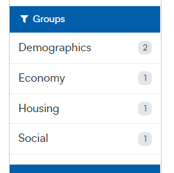

# Navigating the CKAN Interface

### **Before we begin...**

Before we explore the CKAN interface, it's important to understand the basic functionalities and permissions as a CKAN user. 

While you possess the capability to search and access public data, as well as explore your organization's private datasets, note that certain actions, such as adding or modifying datasets, may be restricted based on your user permissions.

Usually CKAN instance's homepage has the following components.

1. **Datasets Search Bar:** The large search bar at the center allows you to search and view any public datasets from various organizations available on the CKAN instance.
2. **Organizations Tab:** Navigate to the "Organizations" tab to access CKAN organizations, crucial for creating, managing, and publishing datasets. User roles within an organization determine authorization levels, such as the ability to create, edit, and publish data.
3. **Showcases:** Explore 'Showcases' that collect the best examples of datasets in use, providing further insights, ideas, and inspiration.

### **CKAN Homepage Interface**

In this guide, we will explore the interface CKAN instance, from the main dashboard to specific features.

As a CKAN user you have the capability to search public data and access your organization's private datasets. However, note that adding or modifying datasets is not within the user's permissions.

Upon your initial login, you'll land on a homepage resembling the one above:

Navigate using the large search bar at the center or click on "Datasets" to explore and view any public datasets from various organizations available on the CKAN instance

Utilize the "Organizations" tab to access CKAN organizations, essential for creating, managing, and publishing datasets. Users may hold different roles within an organization, each role granting specific authorization levels such as the ability to create, edit, and publish data.

Enhance your dataset search by utilizing 'Groups,' a categorization system that organizes datasets. For instance, a search for 'health' might lead you to relevant datasets.

On the homepage, explore 'Showcases.' Showcases collect together the best examples of datasets in use to provide further insights ideas and inspiration

### **Data Page**

****

On the data page of a CKAN instance, the layout is designed for seamless data exploration:

**Central Dataset Window**: At the center of the page, a window displays all datasets neatly stacked up below the search bar. This is your hub for discovering and navigating through available datasets.

**Left-side Search Filters:** On the left side, you'll find search filters. These filters serve as handy tools to refine and pinpoint your search with just a few clicks. For instance:

**Filter by location**: You easily filter by the location of the datasets using the map tool widget.

**Organization Sorting**: Easily sort datasets based on the organization they belong to.

**Groups:** Similarly, groups enable you to categorically sort and search your data, allowing for a more streamlined exploration.

---

### Additional Articles

For information head over to our [support page](https://support.dathere.com/support/solutions)