# Organizations in CKAN, Adding, Managing and Deleting.

### 

In CKAN, every dataset belongs to an organization. Each organization has its own set of users, who have permissions to edit existing datasets and create new ones. Users may have different levels of access within an organization. 

For instance, some users can edit datasets but not create new ones, while others can create datasets but not publish them. 

Each organization has its own homepage, where users can access information about the organization and search its datasets. This setup allows various departments or entities responsible for data publishing to manage their own publishing policies

```
Note: Depending on the configuration of your CKAN instance User, you may not have the authorization to create new organizations. In such cases, if you require a new organization, we recommend reaching out to your site administrator for assistance.
```

### Adding a New Organization

To create an organization in CKAN, follow these steps:

- **Step 1:** Click on the “Organizations” link located at the top of any page.  
    
  *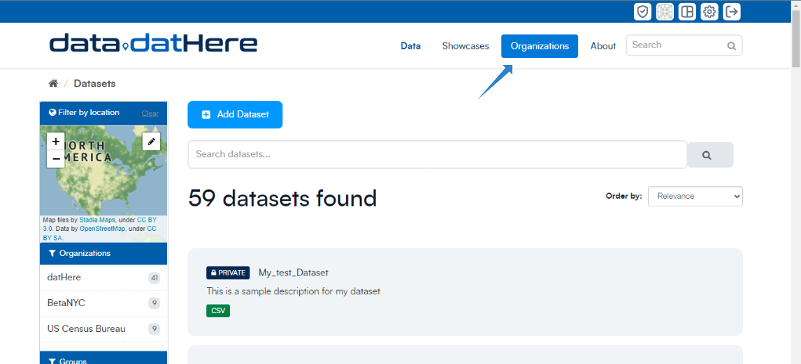*
- **Step 2:** Below the search box, click on the “Add Organization” button.  
    
  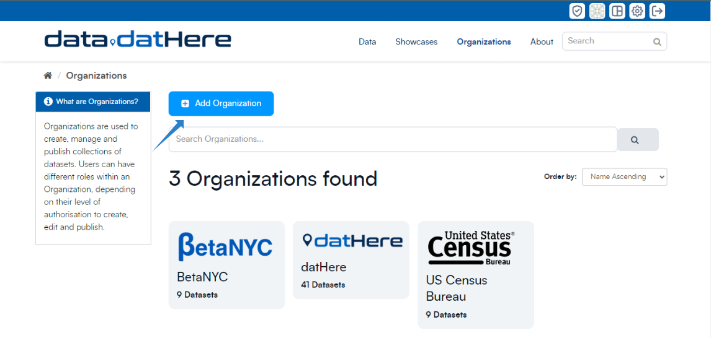
- **Step 3:** CKAN will open the “Create an Organization” page.  
    
  *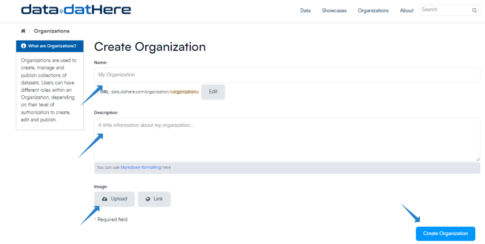*
- **Step 4:** Enter a name for the organization, and optionally provide a description and image URL for the organization’s homepage.  
    
  *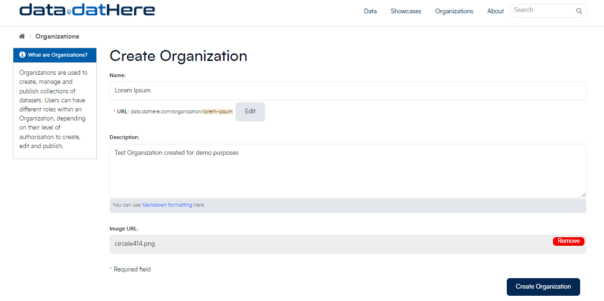*
- **Step 5:** Click on the “Create Organization” button. CKAN will create the organization and display its homepage. Initially, the organization will not have any datasets.  
                           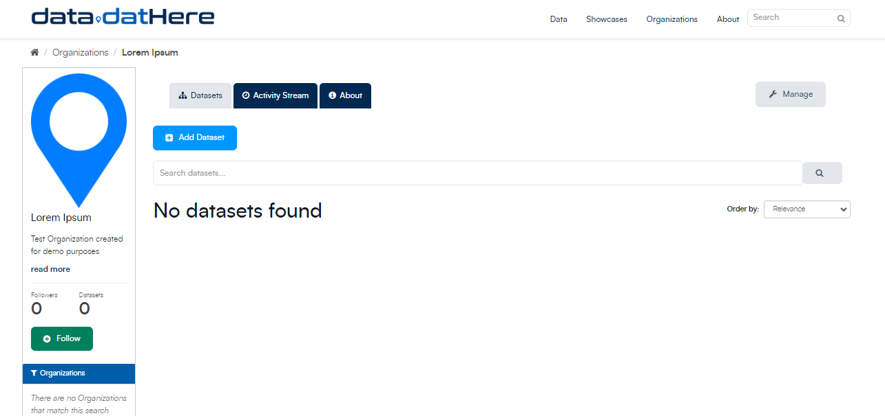

```
You can now change the access privileges to the organization for other users - see Managing an organization below.
 You can also create datasets owned by the organization; see Adding a new dataset above.
```

### Managing an Organization

When you create an organization, CKAN automatically assigns you the role of "*Admin*." 

Clicking on the Managebutton will take you to the organization admin page, which consists of three tabs:***Info*****, ***Datasets********and ***Members.******

*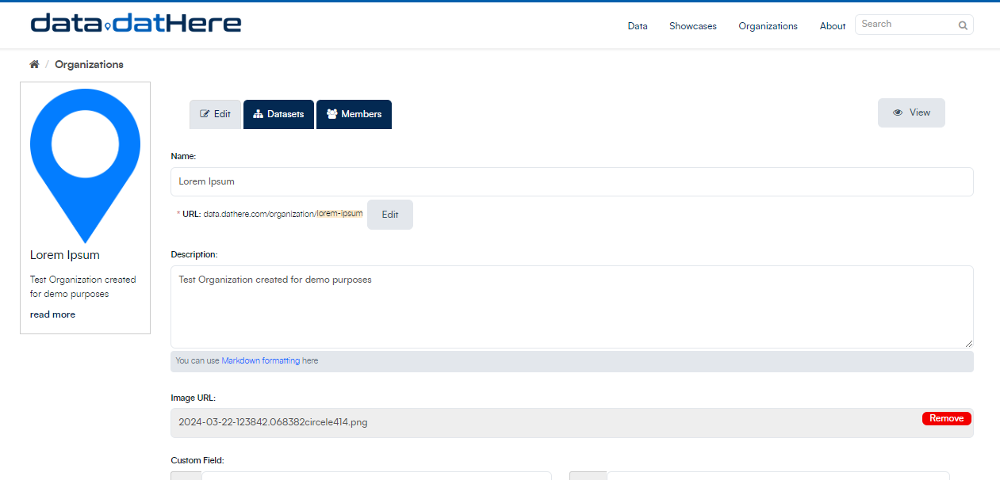*

Under the **"Info**" tab, you can modify the details provided during organization creation, such as the title, description, and image.

Under the "**Members**" tab, you have the ability to add, remove, and adjust access roles for various users within the organization. Please note that you will need to know the usernames of these users on CKAN.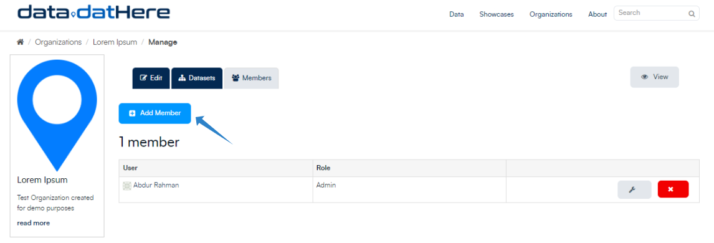

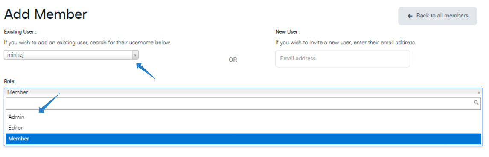

Members of the organization in CKAN are allowed three roles by default:

• **Member –**

- Can see the organization’s private datasets

•**Editor –**

- Add new datasets to the organization
- Edit or delete any of the organization’s datasets
- Make datasets public or private

•**Admin**– 

- Add users to the organization, and choose whether to make the new user a member, editor or admin
- Change the role of any user in the organization, including other admin users
- Remove members, editors or other admins from the organization
- Edit the organization itself (for example: change the organization’s title, description or image)
- Delete the organization

```
When a user creates a new organization, they automatically become the first admin of that organization.
```

### Deleting an Organization

To delete an organization in CKAN, you typically need *administrative privileges*. Here's a general outline of the steps to delete an organization:

- **Log in** as an Administrator: Sign in to your CKAN instance with an account that has administrative privileges.
- Navigate to the **Organization's Page**:   
  Go to the page of the organization you want to delete. You can usually find this by clicking on the "Organizations" link in the CKAN menu and then selecting the specific organization from the list.
- Access **Organization Settings**:   
  Once you're on the organization's page, look for an option or link to access organization settings. This might be labeled as "Settings", "Edit", or something similar.  
  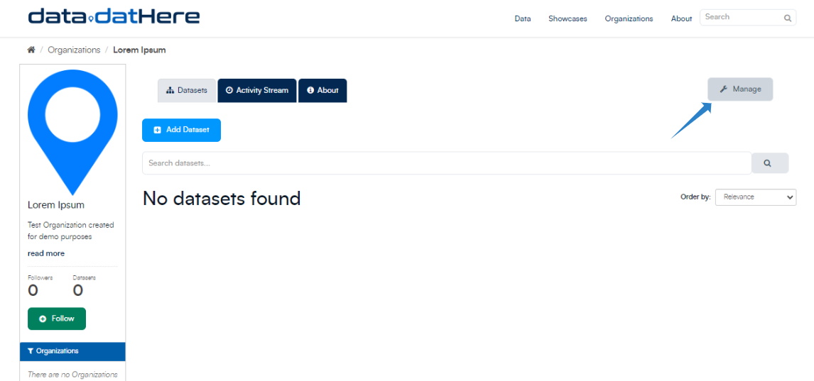
- **Delete Organization**:   
  In the organization settings, there should be an option to delete the organization. It's typically labeled as "Delete Organization" or something similar. Click on this option to initiate the deletion process.  
  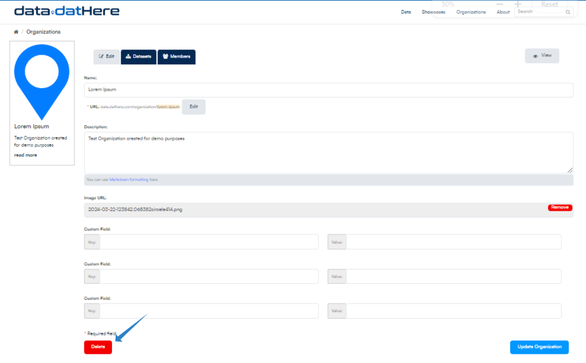
- **Confirm Deletion**:   
  CKAN will usually prompt you to confirm the deletion to ensure it's intentional. Confirm the deletion if you're sure you want to proceed.  
  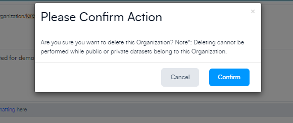

Verify Deletion: After confirming, CKAN should delete the organization along with all associated datasets, resources, and other related information. Verify that the organization has been successfully deleted.

Please note that deleting an organization is a permanent action and cannot be undone. 

Make sure you have the necessary permissions and that you're certain you want to delete the organization before proceeding. Additionally, some CKAN instances might have slightly different interfaces or workflows, so the exact steps may vary slightly.

```
Note: An organization admin in CKAN is an administrator of an organization within the site, with control over that organization and its members and datasets. 
A sysadmin is an administrator of the site itself. 
Sysadmins can always do everything, including adding, editing and deleting datasets, organizations and groups, regardless of the organization roles and configuration options described below
```

---

### Additional Resources

For more information on CKAN, check out the [official documentation here](https://docs.ckan.org/en/2.9/user-guide.html#datasets-and-resources).

If you need assistance or have queries, visit our [support page](http://support.dathere.com/) for more information

[►Publishing Datasets in CKAN: [Guide]](https://support.dathere.com/en/support/solutions/articles/154000133604)

[►Reordering Resources in CKAN Dataset: [Guide]](https://support.dathere.com/en/support/solutions/articles/154000133613)