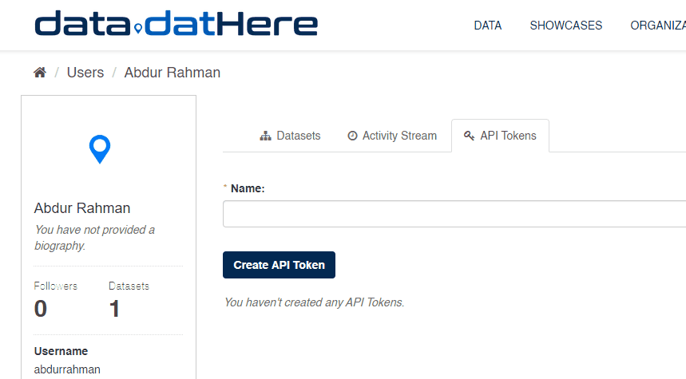

# Using API Tokens in CKAN [Guide]

### Prerequisites

Before diving into using CKAN's API, there are a few prerequisites to keep in mind:

- Familiarity with JSON Parsing: It's essential to have a basic understanding of how to read JSON data structures. JSON (JavaScript Object Notation) is a commonly used format for exchanging data between a server and a web application.
- Understanding REST API Basics: Having a grasp of the fundamental principles of REST (Representational State Transfer) APIs is beneficial. REST APIs follow a set of architectural principles for building web services, making it crucial to understand concepts like endpoints, HTTP methods, and status codes.
- Possession of an API token from the Developer Dashboard: To interact with CKAN's API, you'll need an API token obtained from the Developer Dashboard. This token serves as your authentication credential, allowing you to access and interact with CKAN's resources securely.

### Applications of API tokens

With the CKAN API, your app can:

- **Retrieve data:** Fetch datasets and resources from CKAN for your analysis or application.
- **Update datasets:** Modify existing datasets, add new ones, or remove outdated ones as your data evolves.
- **Manage users and permissions**: Control who can access and edit data on your CKAN site, ensuring security and collaboration.
- **Customize CKAN:** Tailor CKAN's features to suit your needs, from themes and layouts to custom workflows and extensions.

### Generating API Tokens**:**

CKAN simplifies the process of generating API tokens, empowering users to create and manage them effortlessly. Within the CKAN instance, users can navigate to their profile settings to generate API tokens. Each token is unique and associated with specific user permissions, ensuring fine-grained control over data access and manipulation. 

Furthermore, CKAN provides mechanisms for revoking and regenerating tokens, enhancing security and flexibility.

In the Developer Dashboard, API token can be generated, the activity can be viewed on the corresponding API.

---

### Additional Resources

For an in-depth understanding of CKAN Data API, check out the [official documentation here](https://docs.ckan.org/en/2.9/user-guide.html#datasets-and-resources).

If you need assistance or have queries, visit our [support page](http://support.dathere.com/) for more information

[►Publishing Datasets in CKAN: [Guide]](https://support.dathere.com/en/support/solutions/articles/154000133604)

[►Reordering Resources in CKAN Dataset: [Guide]](https://support.dathere.com/en/support/solutions/articles/154000133613)