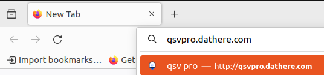
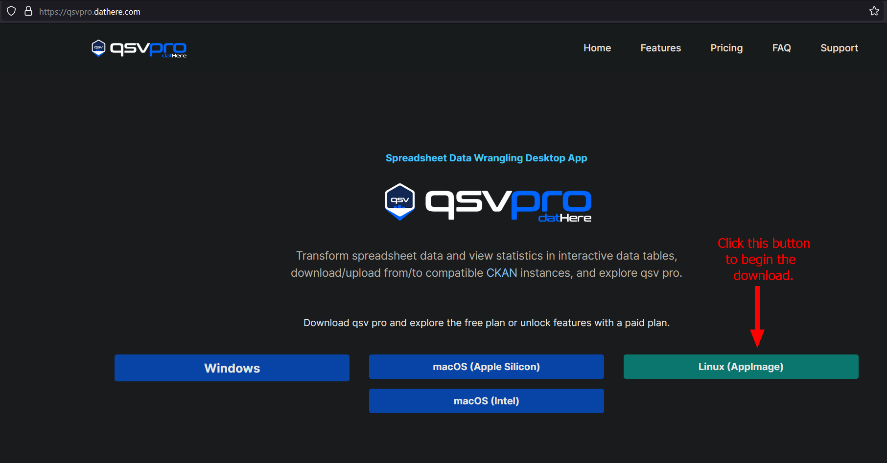
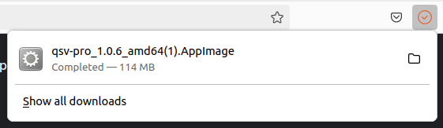
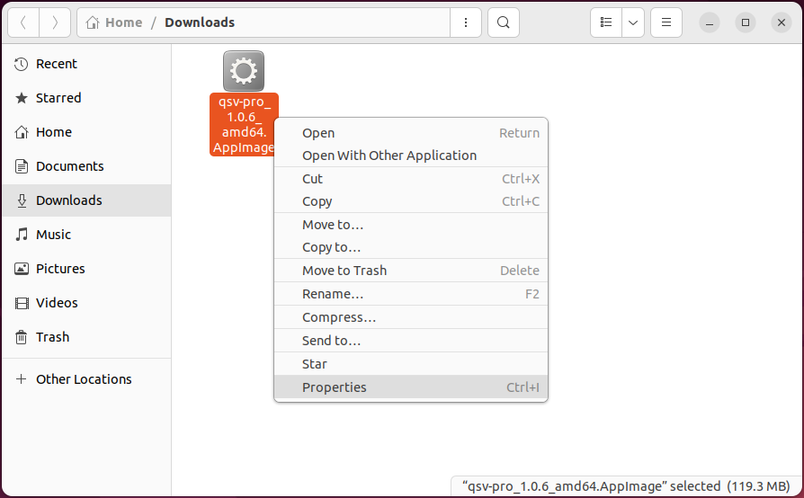
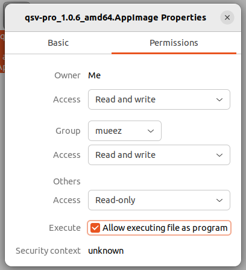
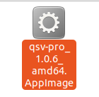

# How to install qsv pro on Ubuntu 22.04

1. Navigate to [qsvpro.dathere.com](https://qsvpro.dathere.com) in your web browser.

2. Click on the **Linux (AppImage)** button to begin downloading the qsv pro AppImage file.

3. Open the folder in your file explorer to where the AppImage is located. By default this should be in **~/Downloads**. Your version of qsv pro may be different.

4. Right click the AppImage file and click **Properties**.

5. Navigate to the **Permissions tab** and click the **Execute** checkbox where it states **Allow executing file as program** to make sure that execution is enabled as indicated by the checkmark.

6. Double left click the AppImage file and qsv pro should now launch.

Note: If your app isn't launching you might not have FUSE 2 installed (which may be required for running an AppImage). [Click here](https://github.com/AppImage/AppImageKit/wiki/FUSE) to follow the instructions for installing FUSE 2 then rerun the AppImage once you've installed FUSE 2.