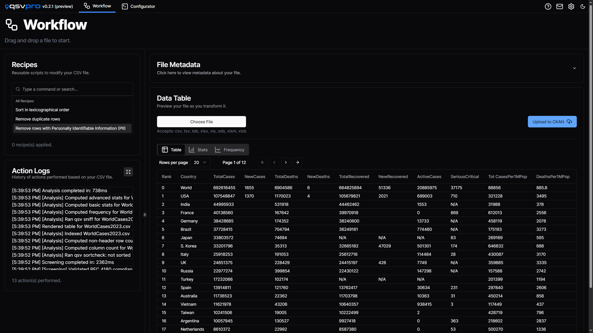
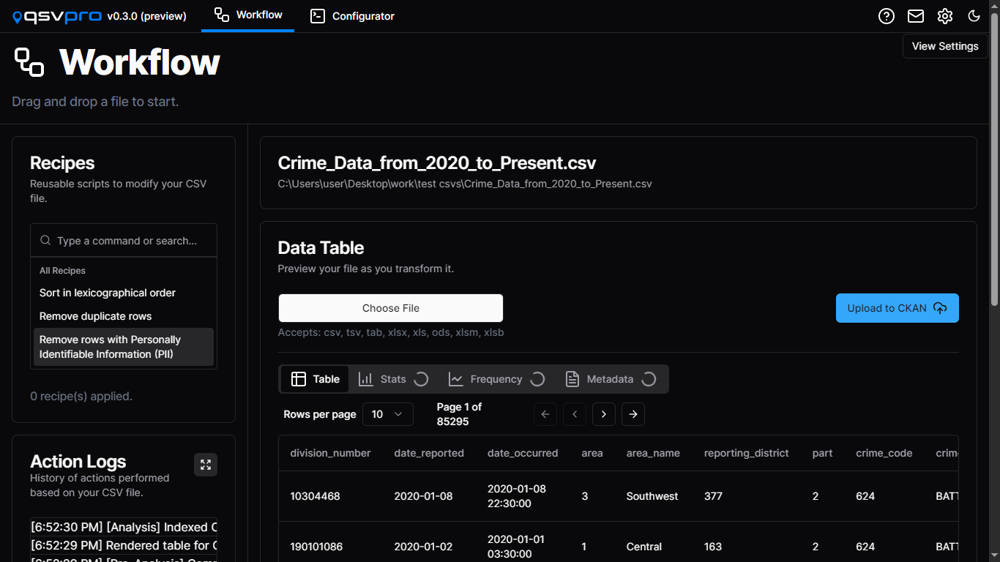
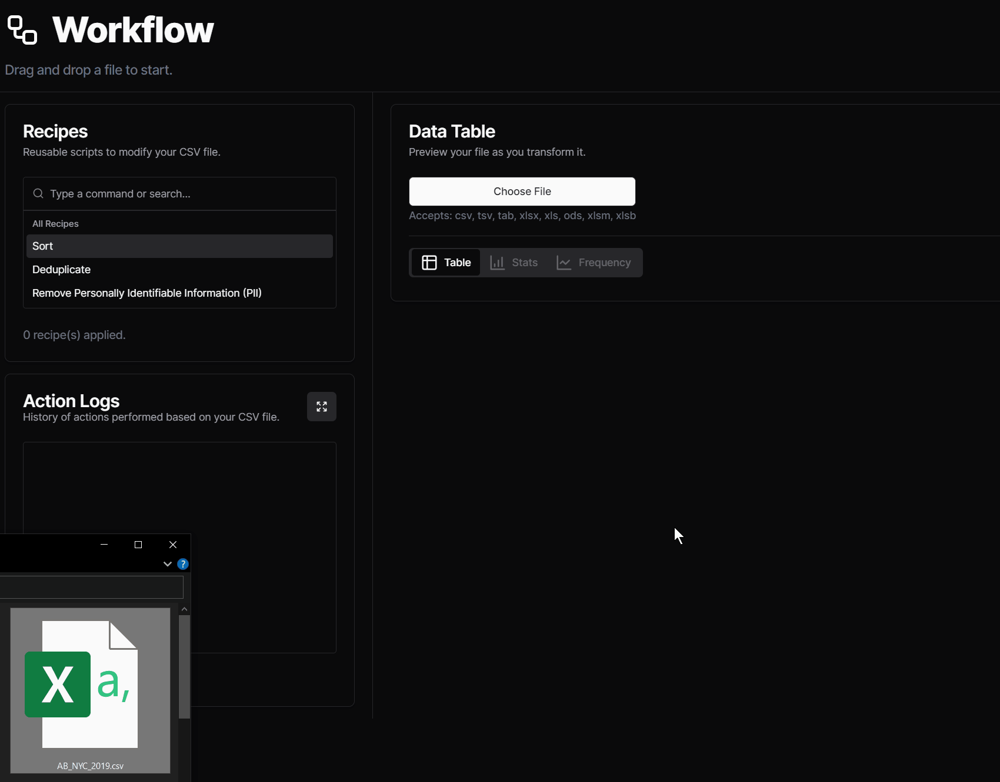
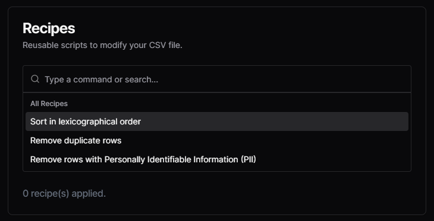
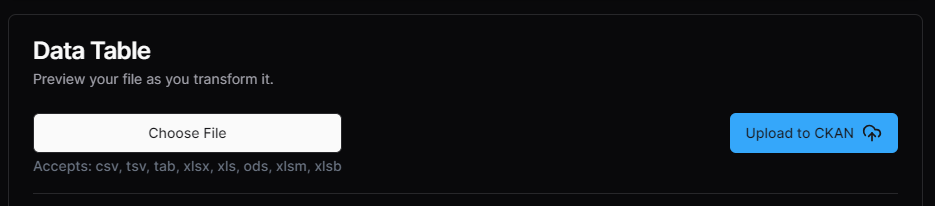
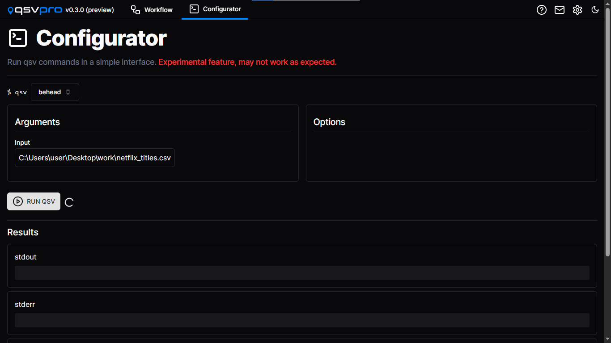

# Overview of qsv pro

> Transform and upload spreadsheet data to CKAN with our streamlined desktop app [qsv pro](https://qsvpro.dathere.com), featuring "recipes" for common data wrangling tasks. Based on the qsv CLI tool.

## **Introduction**

Picture this: you, the modern-day data pioneer, navigating through the intricacies of information, seeking clarity in the vast sea of data. Now, enter qsv pro, not as a tool but as a companion in your data odyssey, simplifying the complex and transforming the way we wield the power of information.

Meet **qsv pro** – your gateway to user-friendly data wrangling experience. Whether you're a business professional, a researcher, or someone who simply wants to make sense of data without diving into the intricacies of technology, qsv pro is here to simplify the journey. 

---

 

## **What is qsv pro?**

Imagine a tool that turns the complexities of working with data into a user-friendly adventure. 

qsv pro, a desktop application, can help with that. It’s designed to make data wrangling accessible, irrespective of technical expertise. If you've ever felt daunted by the prospect of handling large datasets or wished for an intuitive way to transform information, qsv pro may be the choice for you.

### **No Tech Jargon, Just Results**

qsv pro takes the powerful capabilities of the[qsv command-line toolkit](https://github.com/jqnatividad/qsv) and presents features in a graphical interface, sparing you the need to decipher technical commands. It's like having a skilled data assistant at your fingertips, ready to help you sort, filter, and understand your data without the headache of traditional data manipulation methods.

## **Noteworthy features:**

### **User-Friendly GUI:***Designed for the maestro and the novice alike*

    Intuitive graphical user interface for users who prefer a visual approach to data manipulation.

## 

### **Drag-and-Drop Import:***Workflow with Effortless Data Importation*

    Effortlessly import data by dragging and dropping a spreadsheet file directly into the application.

### **Suite of Recipes:***Predefined Data-Wrangling Recipes*

    Now, let's talk recipes. (Not the culinary kind) qsv pro offers a suite of predefined recipes (scripts) for common data wrangling tasks, such as sorting, removing duplicates, and handling sensitive information. (More to come) These recipes streamline complex operations with a click.

****

### **No Programming Required:**

Designed for users to wrangle data without needing command-line knowledge or programming skills.

### **Compatibility Beyond CSV:**

While CSV is the primary focus, qsv pro is designed for versatility, supporting various data formats including Excel, .tsv, .tab, .xls, .ods, .xlsm, .xlsb

### **CKAN Integration:***CKAN Datastore Downloads and Uploads*

Seamlessly upload transformed data to a CKAN datastore using the integrated CKAN API. qsv pro includes a browser to view organizations, datasets, and resources within your CKAN instance to download, upload, or replace a resource.

### **Run qsv terminal commands with the Configurator GUI**

****

---

This is just a preview of what qsv pro has to offer – where tech meets simplicity, where handling data can feel like like second nature, and where your data adventures may be set as nothing short of amazing.

Learn more at [qsvpro.dathere.com](https://qsvpro.dathere.com).