# Step-by-Step Guide: Data Upload to CKAN in qsv pro

```
Welcome to our easy guide on how to use qsv pro to seamlessly upload your data onto CKAN, Just follow along
```

## **Step 1:**

After transforming your data file and ensuring it's ready for upload onto a CKAN instance, locate the blue upload button on the right of the screen.

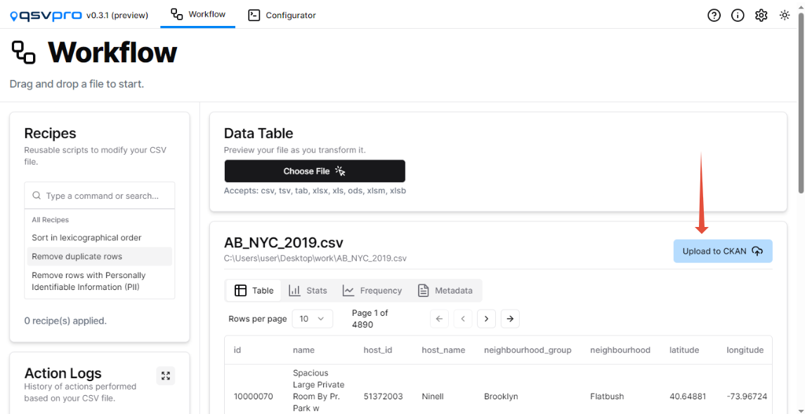

## 

## **Step 2:**

Click on "New instance" if it's your first upload, as there are no saved instances yet.

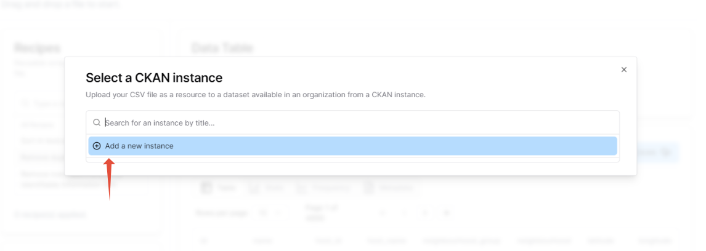

## 

## **Step 3:**

Enter the CKAN instance URL (including https) and then click "Verify" to confirm the instance, in this case we're using datHere's CKAN instance https://[data.dathere.com](//data.dathere.com) 

## 

## 

## **Step 4**:

Once the instance is verified, input your API token from your CKAN instance profile. 

You could generate an API token from your profile in the CKAN instance or, you could just press the 'Create an API Token' button and enter your registered username. 

It automatically generates the link to your Profile where you could easily create an API token.

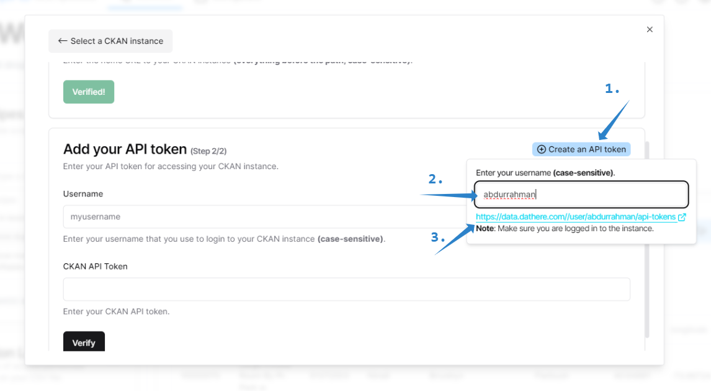  
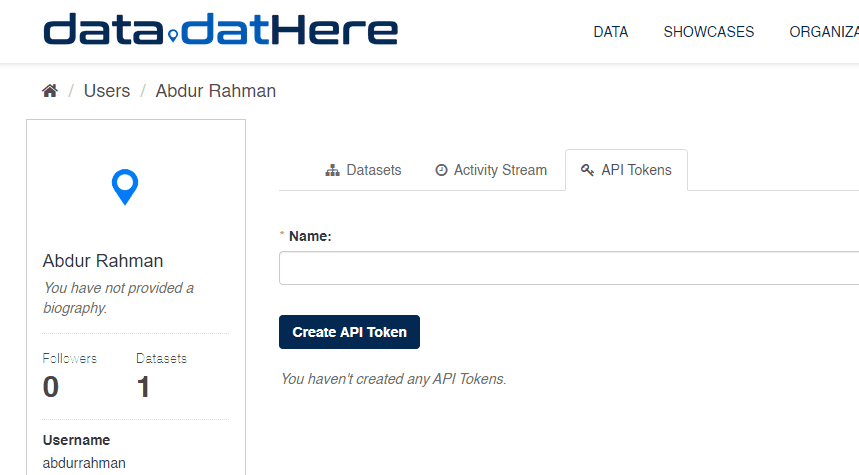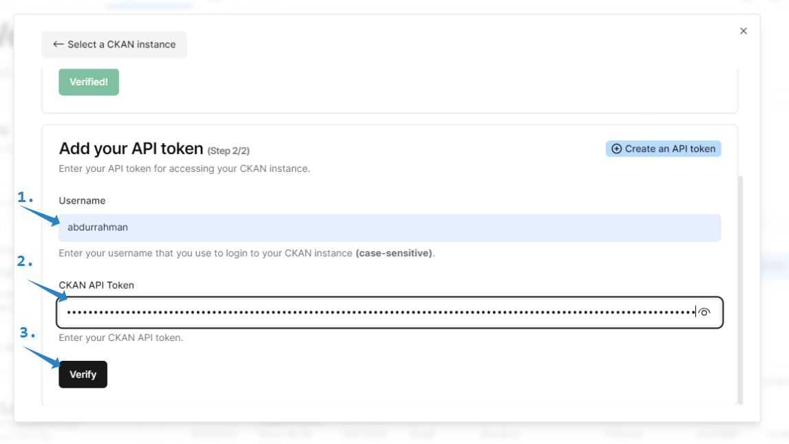

## 

## **Step 5:**

Click "Verify." Successful verification configures your ID, making the CKAN instance selectable. Select your CKAN instance and then choose your organization (datHere in this case).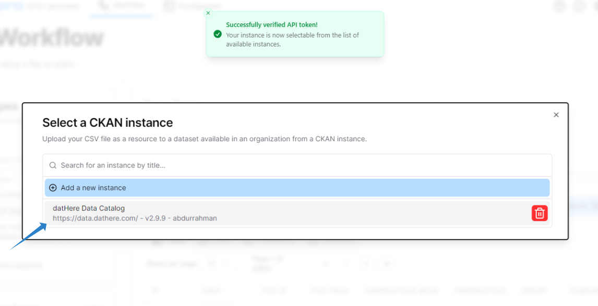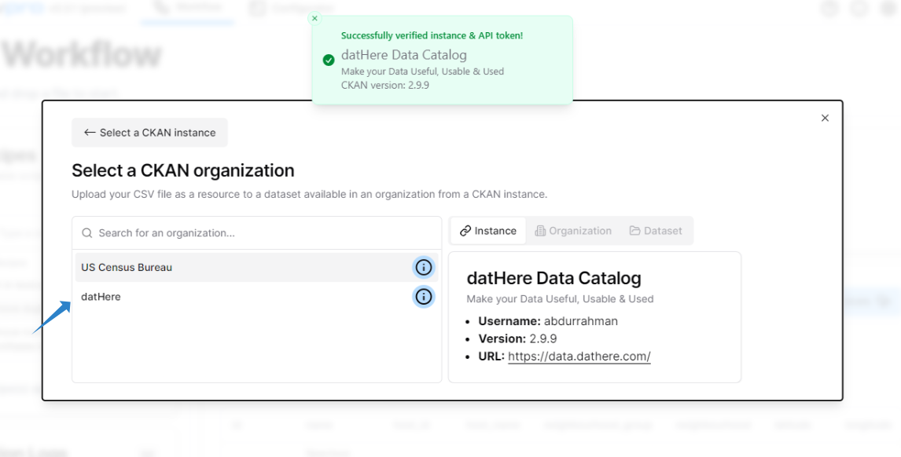 

## **Step 6:**

Select the Dataset to upload the file to, In this case lets, create a new one for better understanding and name it **My\_test\_Dataset**

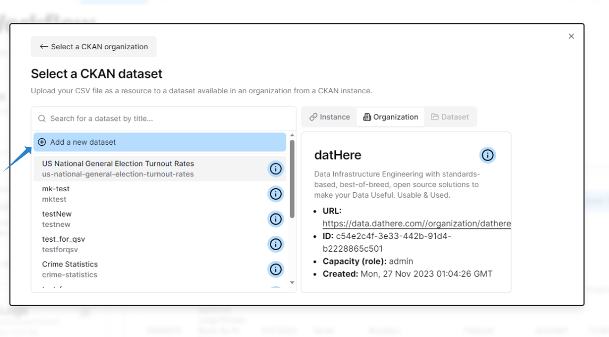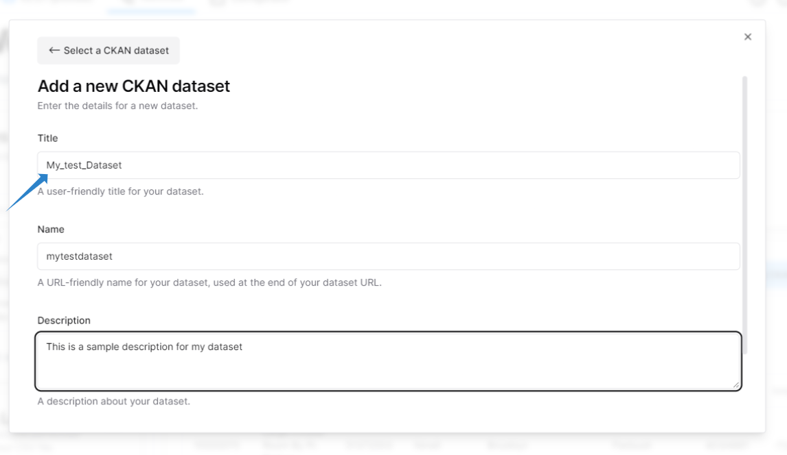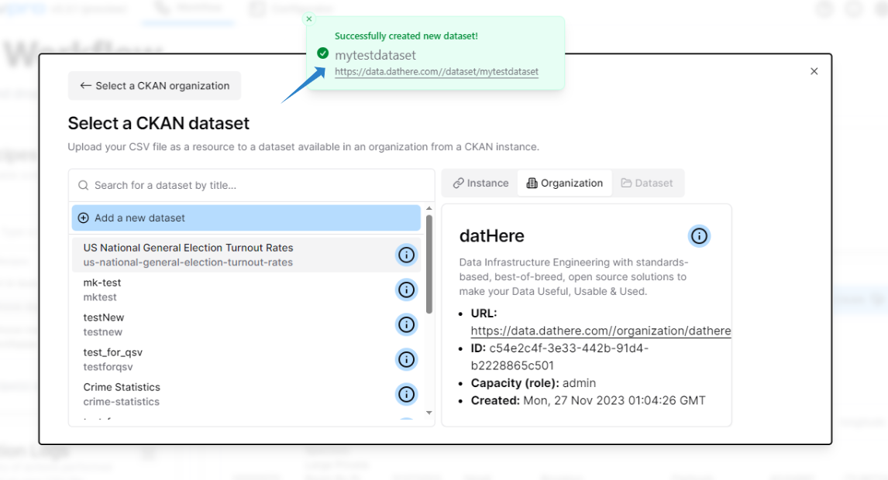

**Step 7: Add Resources**  
Scroll and search your newly created dataset and add the desired resources to dataset from qsv pro. 

 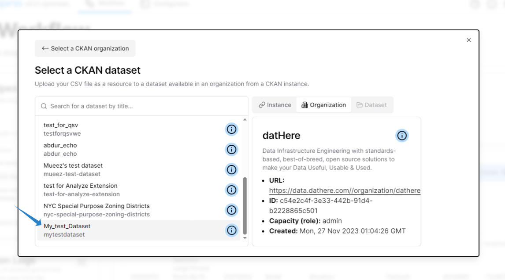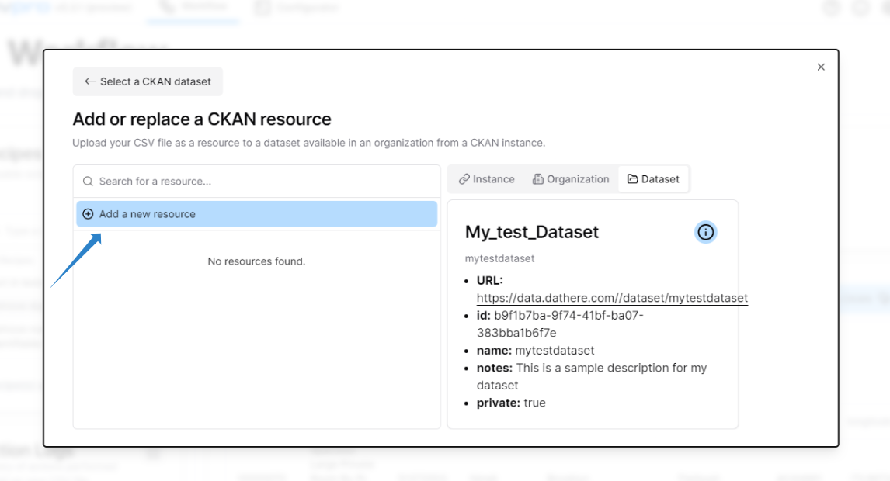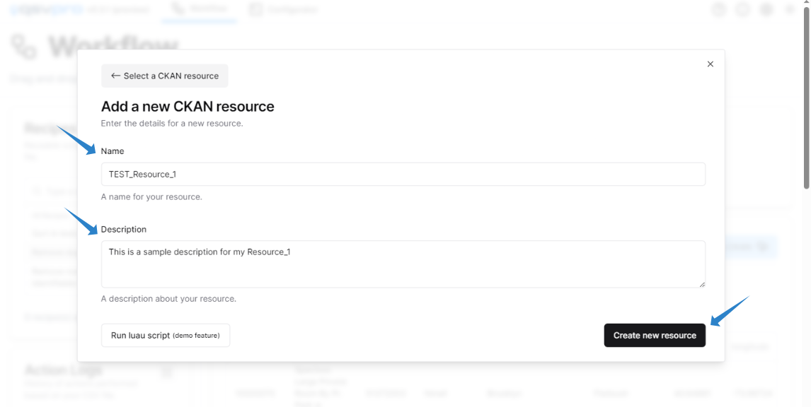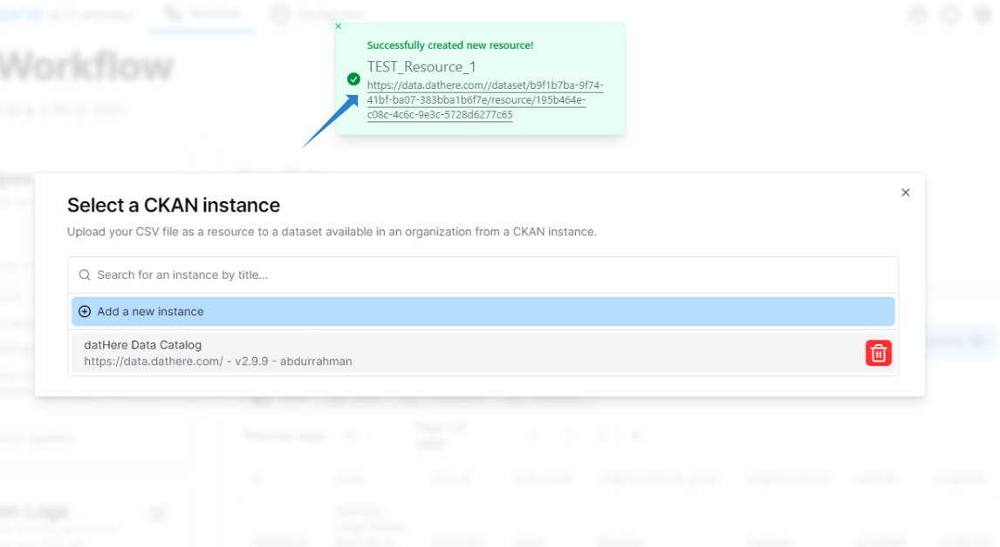

Voila! You're done with your first upload through qsv pro on a CKAN instance