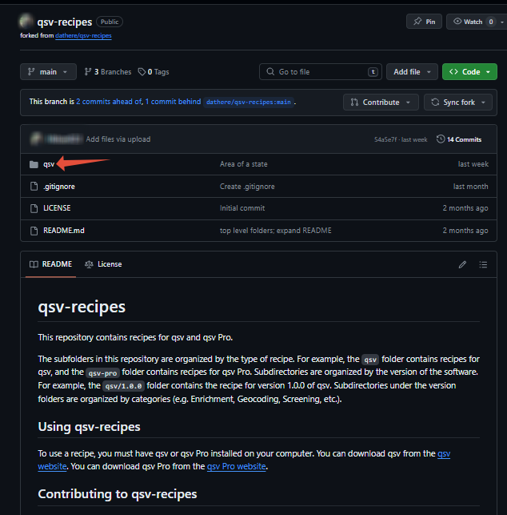
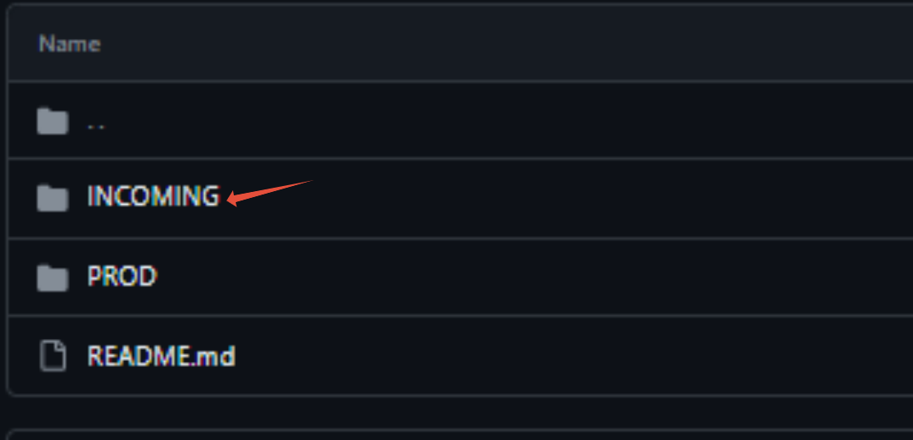
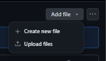
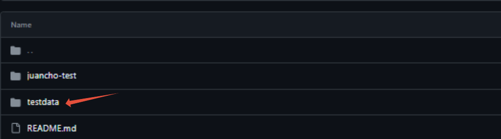
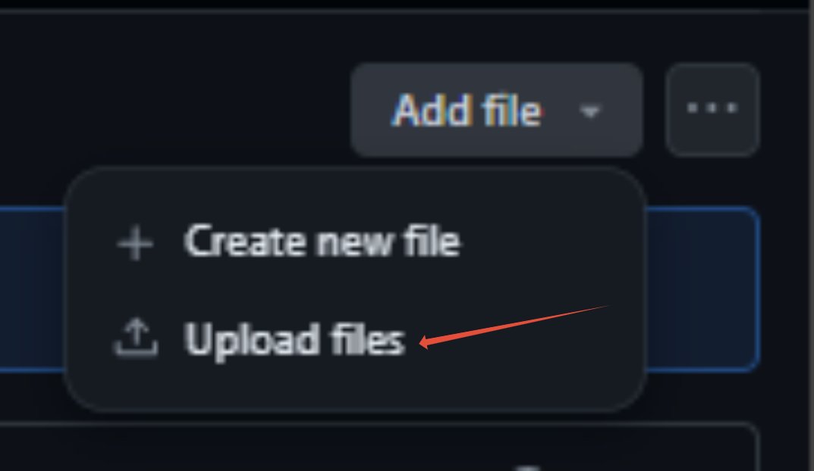
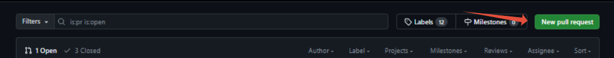
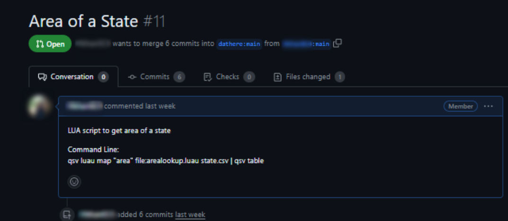

# How to Upload Lua Scripts on Github

Lua has evolved into a popular choice for scripting in various domains, from game development to web applications. Its syntax is clean and concise, making it easy to learn and use. If you're a Lua enthusiast looking to share your scripts and collaborate with others, GitHub provides an excellent platform to host and manage your projects. In this article, we'll explore how to upload Lua scripts to GitHub step by step, empowering you to showcase your Lua creations and engage with a vibrant community of developers.

# Instructions

- Step 1: Upload your Lua file
- Step 2: Upload your CSV file
- Step 3: Create a Pull request

### Step 1: Upload your Lua file

- Go to QSV-recipes and click on the qsv file and then the "INCOMING" file.
- 
- 
- Next, to upload you Lua script, click on the "Add file" drop down and you'll see options to either Create a new file or Upload your file.
- 

### Step 2: Upload your CSV file

- To upload your CSV file, click on "testdata"
- 
- Then click on "Upload files" your CSV file
- 

### Step 3: Create a Pull request

- Click on "New pull request" and then "Create pull request"
- 
- Lastly, wait for approved and you are set!

In conclusion, uploading your Lua scripts to GitHub is a valuable skill that enhances collaboration and showcases your coding projects to the wider community. By following these steps and leveraging GitHub's powerful features, you can effectively manage versions, collaborate with others, and contribute to open-source initiatives.