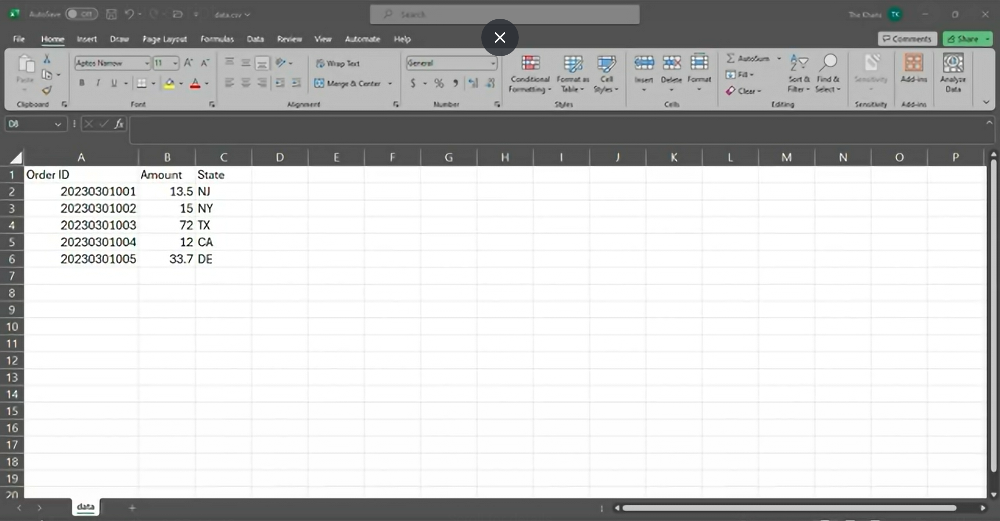
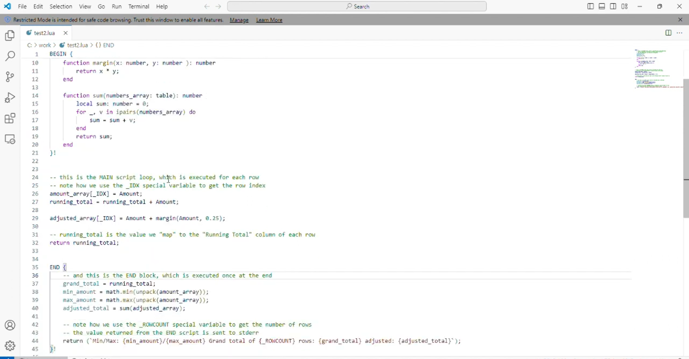
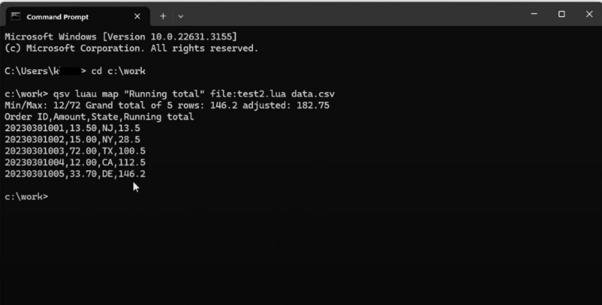

# How to Use Lua Script with QSV Commands

Demonstrating the seamless integration of Visual Studio, Excel for data manipulation, and Command Prompt enhanced with QSV commands for streamlined information retrieval. Whether you're an aspiring coder or seasoned developer, this tutorial offers a comprehensive guide to crafting Lua scripts with efficiency and precision. From setting up your development environment in Visual Studio to harnessing the power of Excel for data management, and leveraging QSV commands in Command Prompt for rapid information access, this video covers it all.

# Instructions

- Step 1: Gather your data
- Step 2: Make a Lua recipe using Visual Studios
- Step 3: Type the command prompt using QSV commands to see the outcome.

### Step 1: Gather your data

- Ensure familiarity with the dataset to be utilized and define the desired outcome. In this context, the objective is to compute the running total for the "Amount" field.
- 

### Step 2: Make a Lua recipe using Visual Studios

- Subsequently, a Lua recipe is crafted with the purpose of facilitating the computation of the running total. This tailored script is designed to streamline the process and ensure accurate calculations.
- 

### Step 3: Type the command prompt using QSV commands to see the outcome

- We first type in the directory where our data is in. Next , using the QSV command we'll type in "Running total", the file of the Lua recipe and the csv you used for the data. Upon pressing enter, the resultant outcome will be displayed.
- 

In conclusion, this tutorial exemplifies the seamless integration of Visual Studio, Excel, and Command Prompt with QSV commands, offering a comprehensive guide for both novice and experienced developers. By following the outlined steps, from gathering data to crafting Lua scripts and utilizing QSV commands, users can efficiently manipulate data and achieve precise outcomes.